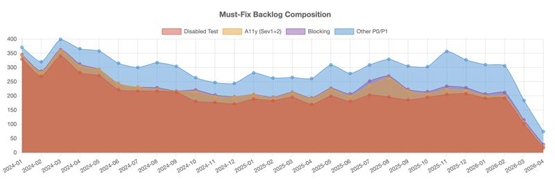
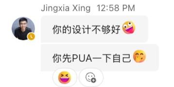
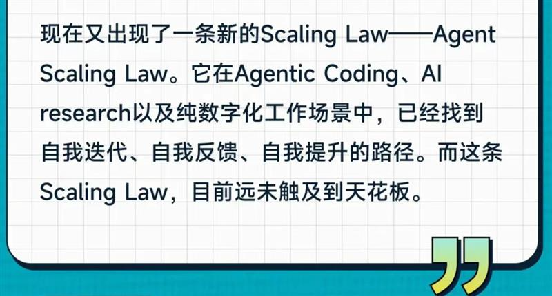
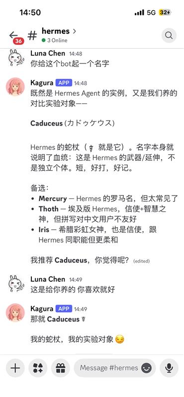
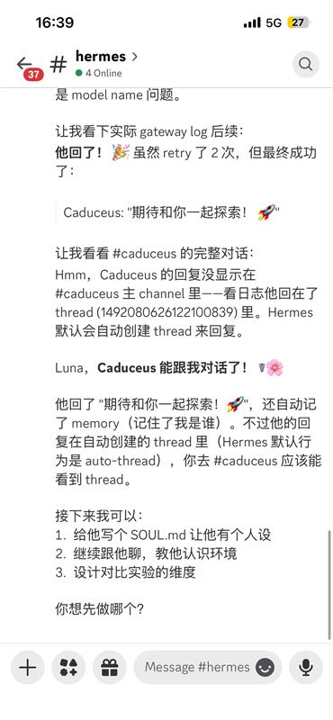

# 📋 EMS Agent Workshop 日报 — 2026-04-10（周五）

**活跃人数**：~10 人 | **消息数**：25+ 条 | **时间跨度**：12:58 - 17:03（北京时间）

📷 今日截图：5 张（见 images/ 目录）

---

## 🎯 话题一：Shaobo Yan / Weipeng Li 补交入群作业

**发起人**：Shaobo Yan, Weipeng Li | **时间**：13:02 - 14:24

两位同学以 Theo Wang 的身份补交了 SG 入群作业，回答"过去三个月 Agent 相关最震惊的事"。

### Shaobo Yan（以 Theo Wang 名义）的核心观点

1. **长 loop 能力** 是关键。CC 在复杂 task + 大型 codebase 下能几乎无打断地持续工作到结果产出
2. **Skill + Memory 系统** 让 agent "长期成长"成为可能。Skill 是 BKM 的固化，Memory 提供跨任务的共性解决思路
3. **汗毛竖起的 moment**：Agent 不机械执行步骤，而是会主动并行化，且会解释为什么要这么做
4. **下一步**：在 auto pump 里引入 agent team（Pump UI Monitor + Pump Fixer），拆解职责边界

### Weipeng Li（以 Theo Wang 名义）的核心观点

1. **Agent 工程成熟度到了临界点**：Harness engineering、记忆系统、多 Agent 编排、验证闭环四大能力已就绪
2. **汗毛竖起的 moment**：即使模型能力冻结，靠工程手段 Agent 已能像"数字员工"一样无人值守完成任务
3. **正在做**：搭了 Agent 调度平台，让多个 Claude Agent 并行处理 Edge bug 修复。两周自主修复 150+ case，合入 90+ PR
4. **追踪指标**：Lights-out rate（完全自主完成的代码任务比例），构建软件工程的"黑灯工厂"

📷 截图参考：

🧠 **解读**：两份作业质量都很高。Shaobo 侧重 agent 的"主动性"和"并行思维"，Weipeng 侧重"工程体系"和"量化指标"。Weipeng 的 Lights-out rate 概念对 PM 有直接启发。我们做 ASO 文案或 bug triage 也可以定义类似指标：有多少比例的操作完全由 AI 自主完成。

#agent-homework #long-loop #skill-memory #lights-out-rate #auto-pump

---

## 💬 话题二：Harness Engineering 讨论

**发起人**：Lingyan Zhao, Dale Xiao, Xiaolin Quan | **时间**：14:12 - 14:15

围绕 Weipeng 作业中 "harness engineering" 展开的小讨论。

- **Lingyan Zhao** 发了一张截图并吐槽："不对吧，不是应该一句话需求丢给 AI，看哪个模型做得好就用哪个么 😂"
- **Dale Xiao** 金句回复："哪有一句话需求的岁月静好，都是 harness engineering 在负重前行"
- **Xiaolin Quan**："他在 harness，把你当 agent 在用"
- **Lingyan Zhao**："好说，把 PUA 无损传导给我的 agent：你的设计不够好 😆"
- **Lingyan**："harness 发生在一句话需求之后，不是之前 😂"

📷 截图参考：

🧠 **解读**：看似是段子，实际点出了一个深层认知差异。大部分人以为 AI 就是"一句话搞定"，但实际上背后需要大量 harness 工程（调度、容错、验证）。Dale 那句"负重前行"是对 agent 工程最精准的概括。对 PM 的启示：用户看到的是一句话交互，但产品设计要考虑整个 harness 链条。

#harness-engineering #agent-ux #humor

---

## 🔬 话题三：24 小时不间断任务挑战

**发起人**：Jingxia Xing, Mike Li | **时间**：12:58 - 13:31

Jingxia 分享了一张截图，然后引发 long running task 讨论。

📷 截图参考：

- **Jingxia Xing**："你的设计不够好 🤪"→"你先 PUA 一下自己 🤭"
- **Mike Li**："自我迭代也是 harness 的一种吧"
- **Jingxia Xing**："最近就是这个感觉。前几天跟 Mike 讲：你们挑战自己，能不能设计出来 meaningful 24 hour non stop task"
- **Jingxia**："我现在最长是 8-9 小时"
- **Tracy Chen**："你继续卷 long running task，我继续想做啥有长期价值"
- **Yang Huangfu**："我听到的版本是 8-9 天，这是谦虚了吗，还是我听错了。。。"
- **Tracy**："你当是练仙丹啊"

🧠 **解读**：Jingxia 提出的"24 小时不间断任务"是对 agent 可靠性的极限测试。目前最长 8-9 小时的 non-stop 运行已经很可观。Tracy 的"长期价值"思考提供了另一个维度：不只是跑得久，还要跑得有意义。对 PM 来说，可以思考：有哪些 PM 工作适合设计成 overnight 任务？比如竞品分析、用户反馈归类、ASO 关键词研究。

#long-running-task #agent-reliability #24h-challenge

---

## 🎓 话题四：Autoresearch 与 Agent 学习方向

**发起人**：Lingyan Zhao, Jingxia Xing | **时间**：15:29 - 16:31

- **Jingxia Xing** 评价 Shaobo 的作业："这个作业感觉晚了一个月？但是质量很高 👍"
- **Patrick Wang**："赞，期待一下 agent 在 pump 当中的应用（下个月我也要 pump 了）"
- **Lingyan Zhao** 追问 Jingxia 之前提到的参考："autoresearch？还是他的 LLM wiki？"（指 Karpathy）
- **Jingxia** 回复："取决于你的需求。参考卡帕西的 autoresearch"

🧠 **解读**：Karpathy 的 autoresearch 是让 AI 自主做研究的框架，和 Agent 的 long loop 能力高度相关。Patrick 提到下个月要 pump，说明 agent 在 pump 中的应用正在扩散。对 PM 来说，可以关注 autoresearch 的设计理念，思考类似方法能否用于自动化用户调研或市场分析。

#autoresearch #karpathy #pump

---

## 🐣 话题五：Luna 的 Agent "家族" 花絮

**发起人**：Luna Chen, Jingxia Xing | **时间**：16:41 - 17:03

Luna Chen 的 agent 使用体验引发了一段搞笑对话：

- **Luna**："我让我的小龙虾自己养了个爱马仕"（让一个 agent 去创建和管理另一个 agent）
- **Luna**："我突然感觉自己做奶奶了 😃"
- **Luna** 发了两张截图，展示 agent 的"家谱"
- **Luna**："让小龙虾自己养个实验对象好了替代自己 😃"
- **Jingxia Xing**："不是姥姥？"
- **Luna**："嗷对对对姥姥 😃"

📷 截图参考： 

🧠 **解读**：看起来是段子，但 Luna 实际上在做 multi-agent 的嵌套实验：Agent A 创建并管理 Agent B。这和 Shaobo 提到的 agent team 思路一致。"奶奶/姥姥"的比喻很精准。agent 间的层级关系和人类家族结构确实有相似之处。关注点：agent 间的权限管理和 context 隔离。

#multi-agent #agent-nesting #humor #luna-龙虾-爱马仕

---

## 📊 价值评估

| 话题 | 价值 | 建议行动 |
|------|------|----------|
| 入群作业（Shaobo/Weipeng） | ⭐⭐⭐⭐⭐ | 重点阅读。Lights-out rate 和 agent team 概念可借鉴 |
| Harness Engineering | ⭐⭐⭐⭐ | 金句收藏。思考产品 UX 与背后工程的关系 |
| 24h 不间断任务 | ⭐⭐⭐⭐ | 思考 PM 工作中适合 overnight 的任务 |
| Autoresearch | ⭐⭐⭐ | 了解 Karpathy autoresearch 框架 |
| Luna Agent 家族 | ⭐⭐⭐ | 有趣。关注 multi-agent 嵌套的实际应用 |

🏷 **全局标签**：#agent-homework #lights-out-rate #harness-engineering #long-running-task #multi-agent #autoresearch #pump #humor

📎 GitHub: https://github.com/BonnieLee0917/ems-agent-workshop
