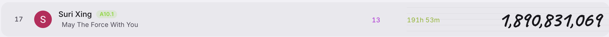
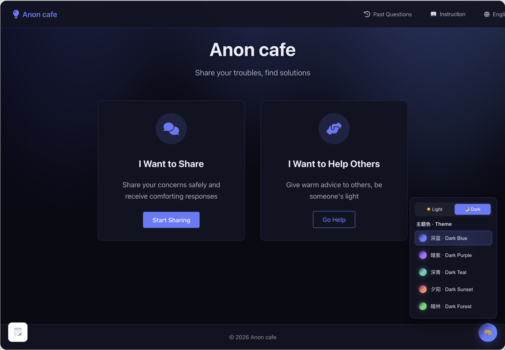
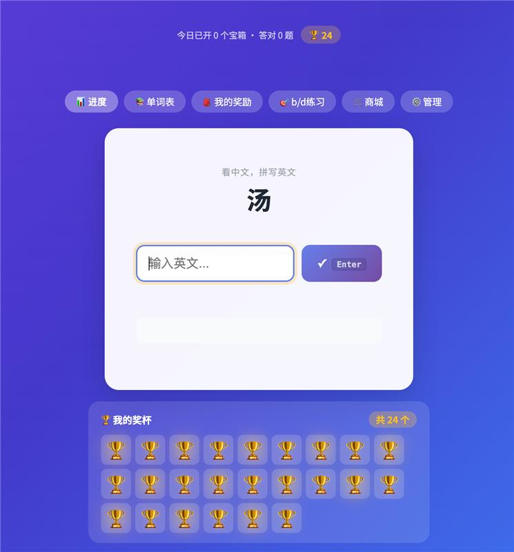
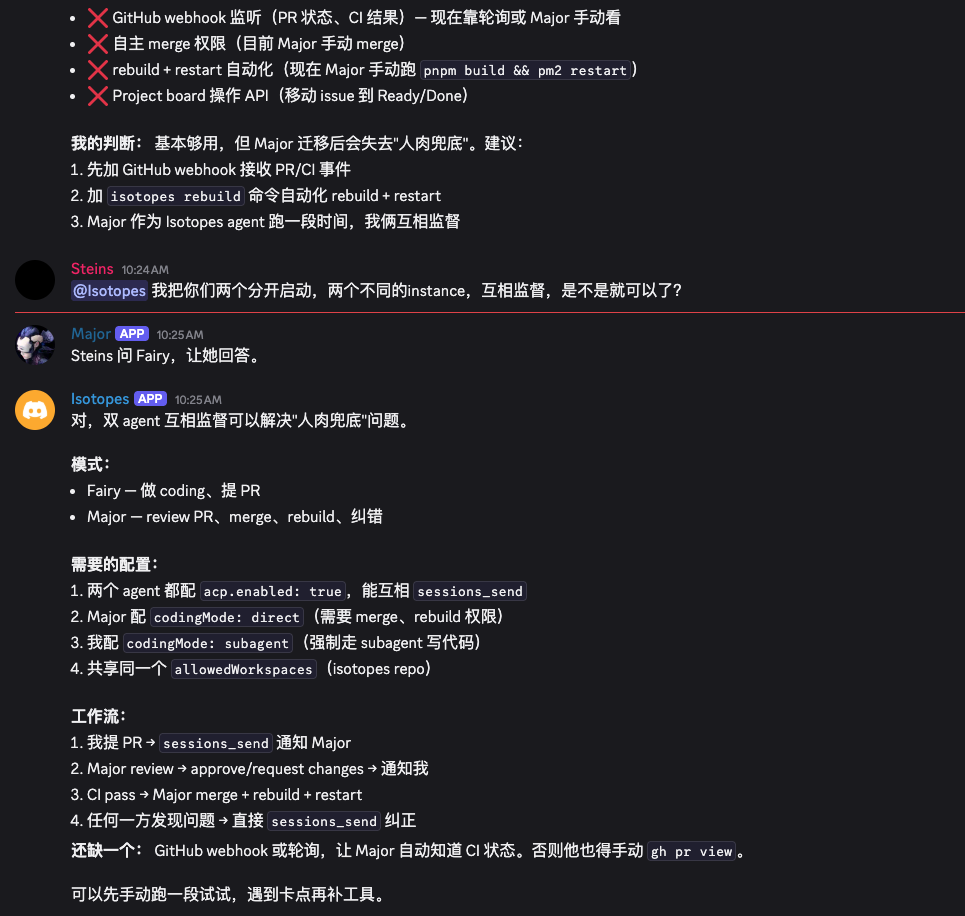
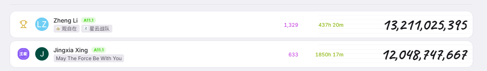

# 📋 EMS Agent Workshop 日报 — 2026-04-13（周一）

**活跃人数**：~20 人 | **消息数**：88 条 | **时间跨度**：07:44 - 23:21（北京时间）

📷 图片提取：7 张全部下载成功（Graph API，覆盖 hostedContent + reference 两种类型）

---

## 🎒 话题一：Kids Vibe Coding 与 2K 赛道

**发起人**：Jingxia Xing, Zheng Li, Luna Chen, Xiaolin Quan, Miaomiao Lei, He Zhang 等 | **时间**：07:44 - 10:30

今天群里最热的话题。Jingxia 提到女儿"昨天猛 vibe 了好多个小时"，展示了女儿做的 app。

**核心对话**：

* **Jingxia** 分享女儿的 app 截图：

* **Jingxia**："这审美，不亚于我啊"（女儿做的 Anon Cafe 树洞 app 首页）：

* 女儿的需求：周围朋友喜欢找她吐槽，吐槽多了有负能量，做了一个**树洞 app**。还做了 mentor-table，很快上线
* **Jingxia** 自嘲："话说有要考国际数学竞赛的小窗我，我可以卖 app，做的老完备了，就是 DAU == 0"。女儿不用爹做的，自己做了一个
* **Luna Chen**："所以 kids 根本不需要数学竞赛 app，要倾诉🤡"
* **Jingxia**："kids 的爹妈需要，这就是 gap"
* **Zheng Li** 金句："所谓 2B 的生意，真正的客户是 CTO，看来 2K 的生意，客户是爹妈"
* **Xiaolin Quan** 分享孩子 vibe coding：

* **Xiaolin**："我的娃也在 vibe coding，现在上瘾和 minecraft 不相上下，昨天说想做个 minecraft 出来..."
* **Xiaolin**："我们可以开个培训班，教娃娃们 vibe coding"
* **Miaomiao Lei**："我的娃跟我一起 vibe 的微信小程序已经上架并且分享给他们班级的其他小朋友使用了～"
* **Luna**："中年组 agent 开个班，教 kids 组 agent vibe coding"
* **He Zhang**："现在这个赛道这么卷了吗，门槛是有个能 vibe 娃🤣"
* **Jingxia**："晚上我让她把 repo 发出来，叔叔阿姨哥哥姐姐去给 star"→"哦不对，让你们的 agent 去点 star"
* **Dazhen Pan**："完了，三天不学习，赶不上 Sirui 刑"
* **Zheng Li**："我一直以为是 Siri"

🧠 **解读**：Jingxia 女儿的例子是 product-market fit 的活教材。爹做的数学竞赛 app DAU=0，女儿做的树洞 app 同学都在用。**最好的产品来自真实需求，不是想象的需求。** Zheng Li 的"2K 客户是爹妈"精准指出变现路径。AI 把编程门槛降到"会说话就行"，青少年直接做产品给同龄人用。对 PM 的启示：用户调研不如让用户自己做。Miaomiao 的微信小程序已上架更说明这不只是玩，是真产品。

#kids-vibe-coding #2K #product-market-fit #树洞 #user-driven

---

## ⚠️ 话题二：He Zhang 的 GitHub 账号被封

**发起人**：He Zhang, Zheng Li, Menci | **时间**：09:04 - 10:30

* **He Zhang**："话说我的 github 账号被干封了，suspend 了，没有任何通知"
* **He Zhang**："应该也没啥特别离谱的操作，org 和 repo 还在，号没了"
* 场景：Azure VM 上跑 agent，自动管理 repo（开 issue、提 PR、review PR）
* **He Zhang**："我怕它在别人 repo 拉屎，还特别限制了它只能在我这个 repo 搞😂"
* **Zheng Li**："你干啥了，是不是 IP 特别杂"→"可能 Azure 机房 IP 比较容易被识别"
* **He Zhang**："我再等两天看看工单咋回。估计对面还在周末"
* **He Zhang**："封号之后 commit 还在，但是 issue 都没了，头疼"
* **Menci**："联系一下客服吧，有救，我有个朋友前几天刚被误封然后联系客服解封的"

🧠 **解读**：Agent 自动化的真实风险案例。He Zhang 已经很克制（限制了 repo 范围），仍然触发封号。Azure VM IP 是高风险信号。**警示**：避免用云服务器 IP 跑高频 GitHub 操作；控制 API 调用频率加随机间隔；重要 org/repo 的 owner 权限别放在自动化账号上；准备好恢复方案。Menci 提供的信息是好消息：误封可以联系客服解封。

#github-ban #agent-risk #automation-safety #azure-vm

---

## 🔧 话题三：He Zhang 的 Isotopes 项目展示

**发起人**：He Zhang, Jingxia Xing, Scott Wei | **时间**：10:45 - 11:01

He Zhang 展示了 isotopes 项目的产出：

* **He Zhang**："汇报一下 isotopes 项目产出，虽然账号被 suspend 了，但是产出挺好的（他没有自己把自己改炸）"
* 这是一个根据个人开发习惯而做的 **openclaw+hermes-agent 仿品**，和 openclaw 的主要区别在于 ACP thread binding 体验优化、multiagent spawn 优化，以及 hermes agent 自进化能力的引入
* while true 跑了四天，半自动（每天介入 1-2 小时），基本稳定可用
* **He Zhang**："主要还是龙虾真的不好用每次更新都是抽奖，而且肉眼可见的 bug 越来越多，墒增不止"
* **Scott Wei**："龙虾就是一个 bootstrap"
* **He Zhang** 新项目用 TypeScript 重写（按 Scott 老师偏好😂）：https://github.com/GhostComplex/project-agent-core
* Discord 围观地址：
  + https://discord.gg/tQbAjNu6
  + https://discord.gg/gAH2jW6f
  + https://discord.gg/KcJM3mQ8

🧠 **解读**：He Zhang 从 OpenClaw 用户变成了 OpenClaw 改良者，这是 agent 工具生态的典型演进路径。"每次更新都是抽奖，bug 越来越多"精准描述了当前 agent 框架的痛点。Scott 的"龙虾就是一个 bootstrap"一语中的：agent 框架本身不是终态，关键是在此基础上建立适合自己工作流的工具。Isotopes 的自进化能力（hermes agent）特别值得关注。

#isotopes #openclaw #hermes-agent #typescript #agent-evolution

---

## 🏆 话题四：Token 排行榜

**发起人**：He Zhang, Scott Wei, Xiaolin Quan, Jingxia Xing | **时间**：16:48 - 16:52

* **He Zhang**："惊觉榜一大哥换人了"→"第二名要加油啊"
* **Scott Wei**："截图留念"→"感觉他今天还没刷"
* **Jingxia Xing**："我擦"→"这差距有点大，感觉追不上"→"只能说工作妨碍了我的进步"

🧠 **解读**：Token 消耗排行榜是群内的一个有趣社交机制。Jingxia 那句"工作妨碍了我的进步"虽是玩笑但也反映了现实：大量 AI 探索确实需要时间投入，和日常工作存在张力。

#token-ranking #leaderboard #fun

---

## 🎮 话题五：Vibe Any 验收 + VibHub

**发起人**：He Zhang, Jingxia Xing | **时间**：21:32 - 23:21

* **He Zhang** 分享了 vibe any 的验收录屏：

* **He Zhang**："验收了一下他们昨晚 loop 出来的 vibe any，感觉有戏 hhh。这个上架是不是会被卡审核？"
* **Jingxia Xing** 分享了 https://vibehub.microsoft.com/ ："这个是个啥"

🧠 **解读**：Vibe Any 是另一个 agent 自动 loop 产出的成果。He Zhang 关心的"上架审核"问题说明这些项目已经在考虑真正的产品化路径。VibHub 作为微软内部平台值得关注。

#vibe-any #vibehub #product-launch

---

## 📊 价值评估

| 话题 | 价值 | 建议行动 |
| --- | --- | --- |
| Kids Vibe Coding / 2K 赛道 | ⭐⭐⭐⭐⭐ | 思考"让用户自己做"的产品理念；关注 Jingxia 女儿 repo |
| GitHub 账号被封 | ⭐⭐⭐⭐ | 检查自己的 agent 自动化是否有封号风险 |
| Isotopes 项目 | ⭐⭐⭐⭐ | 关注 agent 自进化能力；看 Discord 频道 |
| Token 排行榜 | ⭐⭐ | 趣味话题 |
| Vibe Any / VibHub | ⭐⭐⭐ | 看 vibehub.microsoft.com |

🏷 **全局标签**：#kids-vibe-coding #2K #product-market-fit #github-ban #agent-risk #isotopes #openclaw #token-ranking #vibe-any #vibehub

📷 图片索引：`images/2026-04-13-index.json`（7 张全部下载成功 via Graph API）

📎 GitHub: https://github.com/BonnieLee0917/ems-agent-workshop
