# EMS Agent Workshop 日报 — 2026-04-14（周二）

**活跃人数**：~15 人 | **消息数**：~124 条 | **时间跨度**：08:31 - 15:07（北京时间）

📷 图片提取：11 张全部下载成功（Graph API 方式）

---

## 🦞 话题一：龙虾 Harness 方法论 & 龙虾小队实战

**发起人**：Miaomiao Lei, Jingxia Xing, He Zhang, Juanjuan Liu | **时间**：11:03 - 11:34

Miaomiao 吐槽龙虾"像个大傻子"，引出了一场高质量的 harness 方法论讨论和龙虾小队展示。

**核心对话**：

- **Miaomiao Lei**："我的龙虾经过两个星期的调配，在跟我一起做完一个完整项目之后，还是像个大傻子……远不如我的 PM Studio 来得可控"
- **Jingxia Xing** 点出核心："**PM Studio 替你做了 harness，🦞需要你自己做 harness**。你可以找一个成型的方法论帮你 harness 龙虾"
- **He Zhang**："等我 isotope 迭代完也许行，有一个功能就是冷热切换。longxia 我已经放弃让它自己改 config 了，经常把自己改坏了"
- **Jie Tang**："把 Claude Code 代码丢给龙虾让它自己学，能学会么？"→ **Jingxia**："他们的架构不一样，严格来说很不一样。龙虾能出圈因为他和 CC 不是一个路数"

**Juanjuan Liu 展示生产级龙虾小队**：

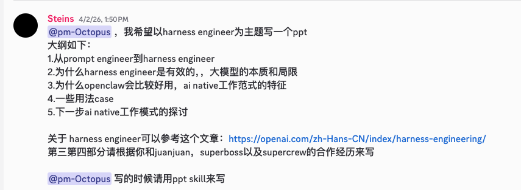

- PM+Design Agent 产出生产级 Spec+Design
- UX Agent 走查验收
- EM Agent 轮训项目管理
- QA Agent 自动化测试、截图、回归、验收报告
- "不能容忍一切随机性和自我发挥，加上了文档化、ADO化管理"
- 🔗 UX 走查验收报告：[Blossom design-alignment-report.md](https://github.com/GhostComplex/Blossom/blob/main/docs/design-alignment-report.md)

**Juanjuan 补充跨 Agent 协作**："每个人自带几个 agent，各自有不同技能。He Zhang 要做 PPT，拉了我的 PM agent，结合你和 dev agent 的合作项目经历来帮我写 PPT，然后 PM agent 就给他写好了"

**Miaomiao 看到 He Zhang 的 Skills 体系后震惊**：

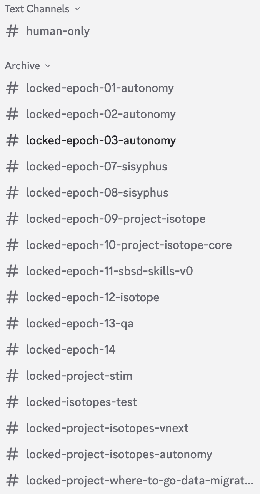

- **Miaomiao**："omg!!! He 这些是啥"
- **He Zhang**："这都是过去做完的 project/scenario。带 epoch 标识的都是已经做过 rca 来让 ai 自己迭代一下自己的 skill 的"

🧠 **解读**：Jingxia 的一句话点明了 agent 好不好用的本质：**工具的可用性取决于 harness 层做了多少**。PM Studio "好用"是因为内置了 harness；龙虾"像大傻子"是因为需要用户自建 harness。Juanjuan 的龙虾小队展示了另一种思路：与其让一个 agent 变万能，不如把角色拆细，每个 agent 有明确职责。

#harness #openclaw #pm-studio #agent-team #production-grade

---

## 🏗️ 话题二：Multi-Agent 基础设施与硬件瓶颈

**发起人**：He Zhang, Jingxia Xing, Dale Xiao, Zhiyuan Zheng | **时间**：11:04 - 11:12

Agent 规模化后的基础设施问题浮出水面。

- **He Zhang**："现在电脑数量已经成瓶颈了，三台电脑只能勉强支撑 6 个 agent 大概四个项目的开发，关键不同电脑如果 workload 高了很容易导致 queue 死锁"
- **He Zhang**："那感觉不行，一定要有集群和 replica"→"要有个分布式的消息队列"

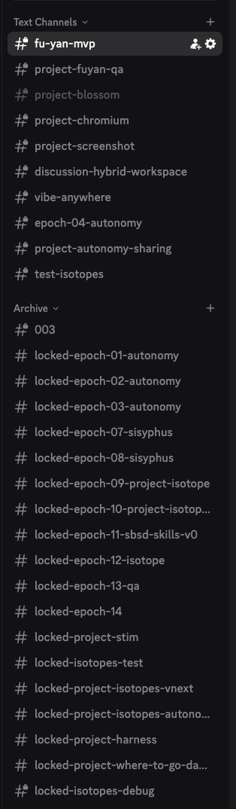

- **He Zhang**："这是现在在 queue 的项目哈哈，根本跑不完"

**Jingxia 的 token 烧钱对比**：

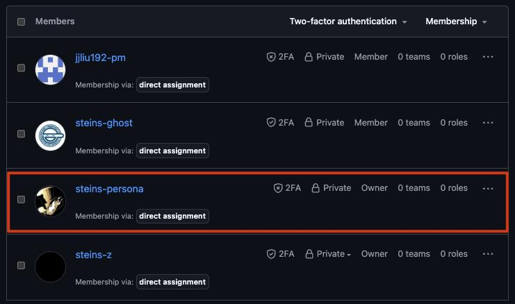

- **Jingxia**："我发现我烧不过这两个败家子了"，@Zheng Li @He Zhang，"我们来比这个吧"

- **Dale Xiao**："这就是金钱的声音吗？"

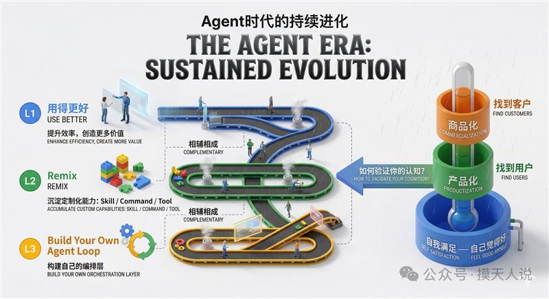

- **Zhiyuan Zheng**："有同事用过这个吗？"
- **He Zhang**："没有，但感觉看起来就是我想要的 a2a k8s。这个真的可以搞"

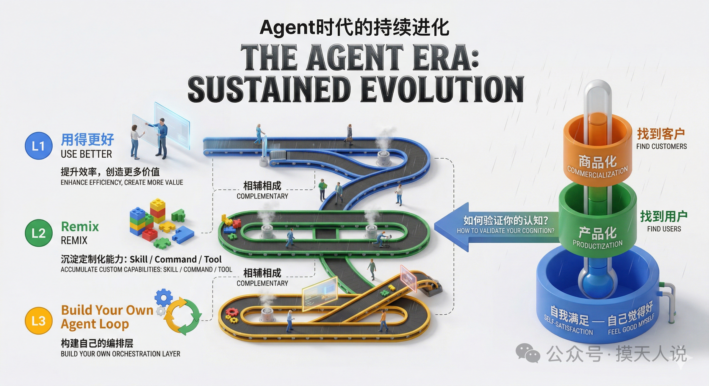

- **Jingxia**："童杰他们组做的，有点类似 Trae"

**He Zhang 的 Discord Skills 体系**：

> discord server invitation 在这里：https://discord.gg/3GbNcZ9w
> 所有的积木都抽象成了 skill 放在了这里 https://github.com/GhostComplex/skills
> 下周 sharing 有一部分会分享怎么去用这些 skill+openclaw 构建一个 e2e 的全自动开发流程

- **He Zhang**："正在进行的一般都会设置成 private，以免有人错误的在里面发言干扰他们 loop"

🧠 **解读**：当 agent 从"一个人用一个"变成"一个人管六个"，单机架构扛不住了。A2A + K8s 的组合可能是未来 agent 基础设施的主流形态。He Zhang 的 Discord Skills 体系把所有能力抽象为可复用的 skill，通过 epoch 标识做自我迭代。Jingxia 的 token 账单对比更是直观展示了 agent 规模化的成本问题。

#multi-agent #infrastructure #a2a-k8s #distributed-system #discord-skills #token-cost

---

## 🛠️ 话题三：Bojun Chai 的 claude-starter

**发起人**：Bojun Chai | **时间**：10:41 - 10:58

**Bojun 分享手写风格的宣传图**：

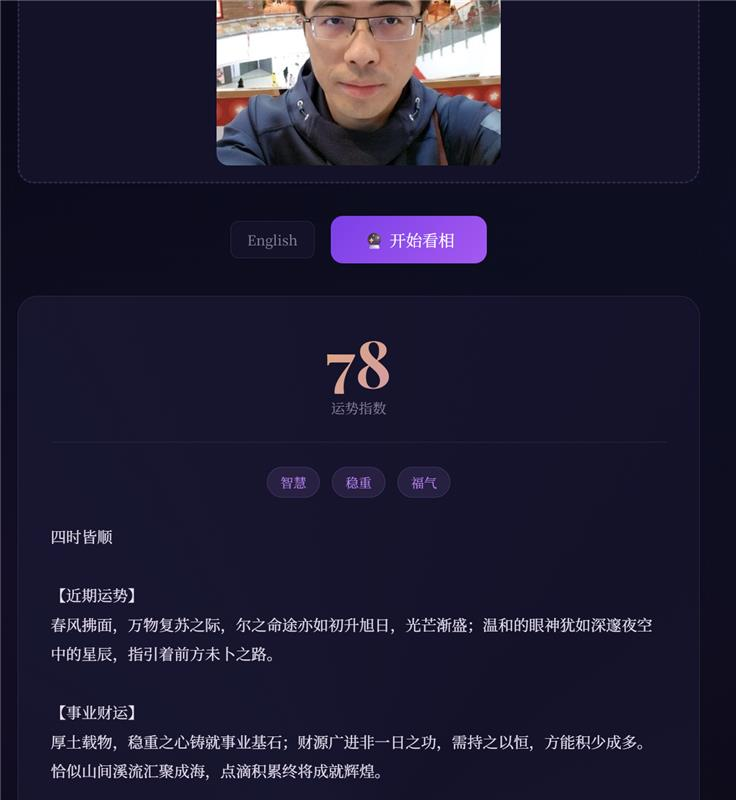

- **Bojun**："看着像肉手写的，看到最后的 Tag 吓了一跳"

> "为解决 /resume 过于难用找不到 session 的问题，搞了一个 claude-starter"

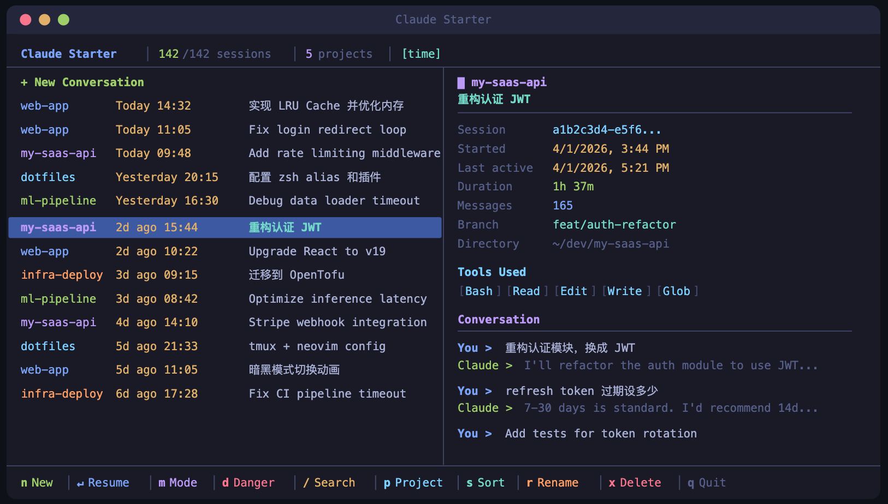

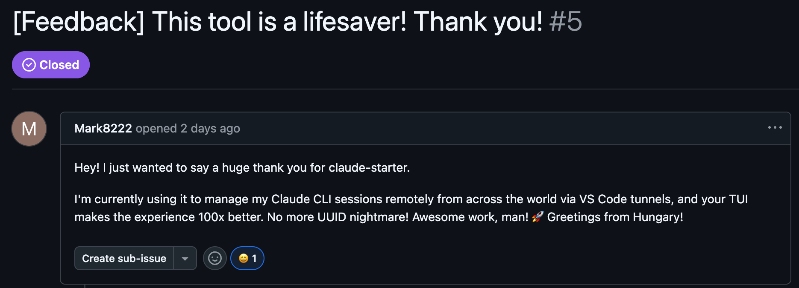

- 安装：`npm install -g claude-starter`
- Codex 版本：`npm install -g codex-starter`
- 已有 **1.2k+ npm 下载** + "全球好评（共 1 条）"，号称"体验 100x"
- **Jingxia** 追问："咋做的啊？你把 claude 包起来了？同时十个 session 人的福音啊"

🧠 **解读**：小工具大价值。`/resume` 是 Claude Code 用户的共同痛点，Bojun 用一个轻量 CLI 就解决了。1.2k 下载说明需求真实存在。

#claude-starter #developer-tools #session-management #npm

---

## 🔍 话题四：OPC → 梦工厂 & Claude Dispatch 对比

**发起人**：Mike Li, Xiaolin Quan, Jingxia Xing | **时间**：11:03 - 14:30

**Mike Li 对比 OPC vs Superboss vs Claude Dispatch**：

> "OPC is strongest on execution quality (mechanical gates, harness enforcement). Superboss is strongest on team coordination (issue tracking, Discord workflows)."
> "我昨晚用了一下 claude 的 dispatch 远不如🦞方便"

**OPC 更名为"梦工厂"**，Jingxia 分享作品：
- AI Song：https://dreamworks-ai-song.vercel.app/
- Face Fortune（看相）：https://dreamworks-face-fortune.vercel.app/

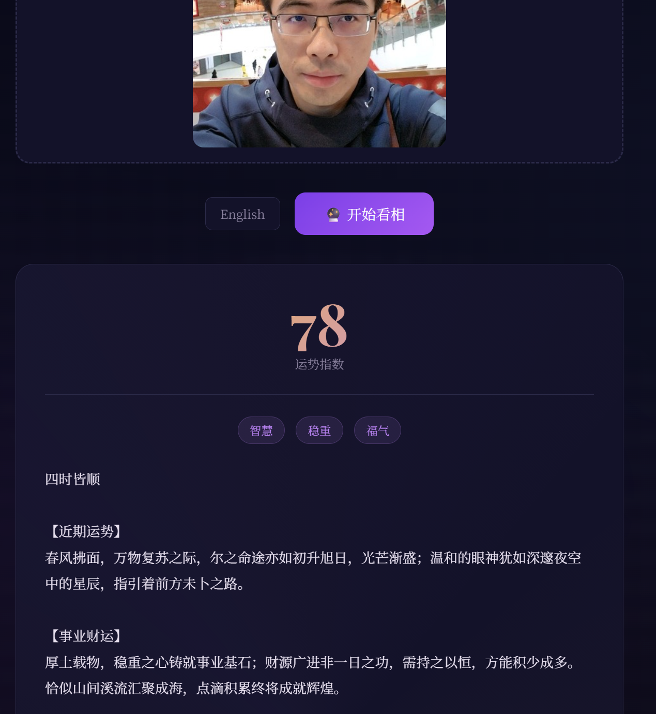

- **Jie Tang**："这个看相不错，我的目标用户群体应该会很喜欢"
- **Jingxia**："帮我去看看能咋收费"→"我给你3成"
- **Jie Tang**："做小程序，每天免费看一次，再看需要看30s广告"

**OPC 的自复制能力**：He Zhang 和 Xiaolin 都已经蒸馏出自己的 OPC 版本。

🧠 **解读**：OPC/梦工厂从工具变产品，从 token 消耗变价值产出。OPC 能"自复制"（蒸馏出自己的版本）是一个里程碑。Face Fortune 的变现讨论也很实际。

#opc #dreamworks #claude-dispatch #face-fortune #monetization

---

## 📰 话题五：Skills 建设倡议 + He Zhang GitHub 后续

**发起人**：Jingxia Xing, He Zhang | **时间**：14:57 - 15:07

**Jingxia 号召全员建 Skills**：

> https://mp.weixin.qq.com/s/w8OIOK0ETp9ZR3pq_DCdKQ
> "Everyone 真心建议大家看看。并且鼓励大家一个月之后都能有自己的 10+ skills"

**He Zhang 的 GitHub 封号后续**：

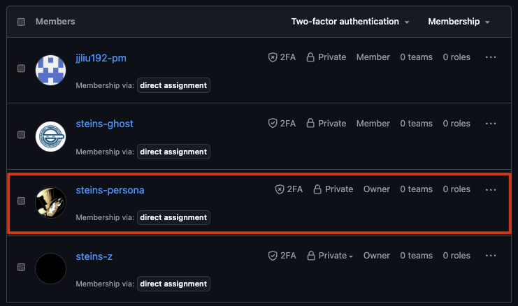

- He Zhang 为防止大号也被封，搞了个 backup 方案
- "猜猜 Mike Li 老师能 get 新的梗"

🧠 **解读**：Skills 本质是把经验和最佳实践固化为可复用的能力模块。10+ skills 是一个好目标。He Zhang 的 backup 策略也值得借鉴：agent 自动化操作一定要和主账号隔离。

#skills #github-backup #agent-risk

---

## 📊 价值评估

| 话题 | 价值 | 建议行动 |
| --- | --- | --- |
| 龙虾 Harness & 龙虾小队 | ⭐⭐⭐⭐⭐ | 建 harness 再用 agent；看 Blossom 验收报告 |
| Multi-Agent 基础设施 | ⭐⭐⭐⭐ | 关注 A2A+K8s；看 He Zhang 下周 sharing |
| claude-starter | ⭐⭐⭐ | `npm install -g claude-starter` |
| OPC/梦工厂 & Dispatch | ⭐⭐⭐⭐ | 试用梦工厂作品；关注 OPC 蒸馏能力 |
| Skills 倡议 | ⭐⭐⭐⭐ | 看微信文章；开始封装自己的 skills |

🏷 **全局标签**：#harness #openclaw #agent-team #multi-agent #a2a-k8s #claude-starter #opc #dreamworks #skills #github-backup #token-cost
