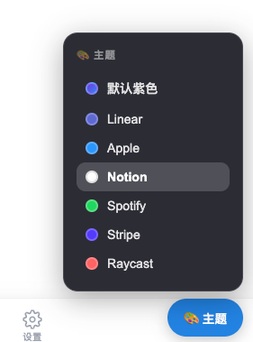
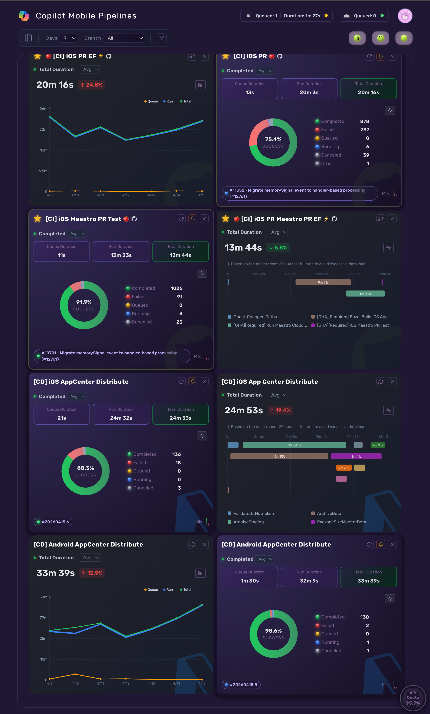
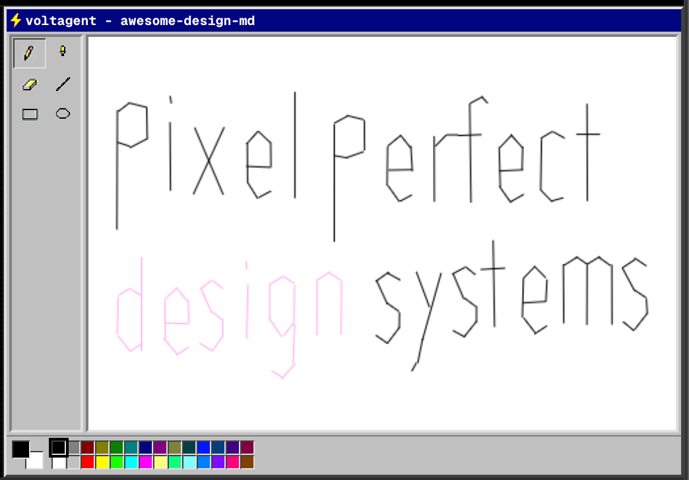
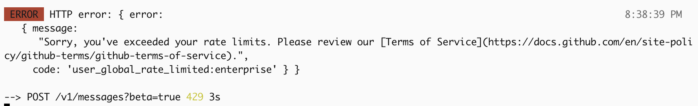
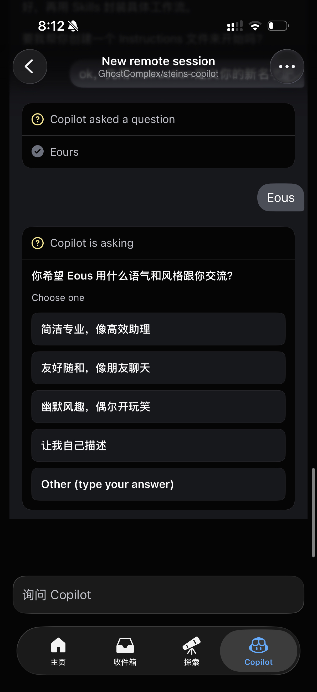

# EMS Agent Workshop 日报 — 2026-04-15（周二）

**【Graph API 图片修复重跑版】**

**活跃人数**：~15 人 | **消息数**：129 条 | **时间跨度**：10:31 - 22:59（北京时间）

📷 图片提取：7 张有效图片全部下载成功（Graph API hostedContent，修复前仅 4 张）

---

## 🎨 话题一：Design 模仿、Sentry 风格改造、IA 工具开始成形

**发起人**：Patrick Wang, Xiaolin Quan, Bojun Chai, Qun Mi, Jingxia Xing | **时间**：13:29 - 14:26

下午最有料的话题是设计模仿和 IA 工具化。大家从 `getdesign.md` 聊到 `getia-md`，已经不是"能不能做"的阶段了，而是开始比谁先做成可用产品。

**核心对话**：

* **Patrick Wang** 提到：设计可以直接交给 `getdesign.md` 让 agent 模仿
* **Xiaolin Quan** 接话说：`googlestich` 那个已经用上了
* **Bojun Chai** 拿出实际结果：用这套方法把 pipeline dashboard 改成了 **Sentry style**，还补了一句"你别说你还真别说"
* **Bojun** 继续追问："怎么可以没有 Microsoft 呢"，随后又发了一张补图，指出右上角这个倒是 Microsoft
* **Qun Mi** 明确说自己想研究"直接上来 skill 做测试"的方案，但外面已经飘着不少类似方案，多少有点不自信
* **Xiaolin** 抛出一个很具体的需求：有没有那种专门做 information architecture 的
* **Bojun** 直接把东西做出来了：`getia-md` 已经上线，而且还用它做了 5 个内网可访问的 demo

🧠 **解读**：这段讨论很典型。群里已经从"prompt engineering"往"资产化能力"走了。`getdesign.md` 解决的是风格迁移，`getia-md` 解决的是信息架构落地。前者让 agent 更像设计师，后者让 agent 更像产品原型工厂。对 PM 来说，这比单点 demo 值钱得多，因为它开始触到重复生产的能力。**真正值得跟的不是某一张图做得像不像，而是这种能力能不能稳定变成 workflow。**

#design-mimic #getdesign #getia #information-architecture #workflow

---

## 🏭 话题二：Todo List 正在变成 App Factory

**发起人**：Jingxia Xing, Zheng Li, Bojun Chai, Miaomiao Lei, Mike Li, Xiaolin Quan, Jie Tang | **时间**：14:02 - 17:50

第二条主线是"从想法记录，到边记边做"。Jingxia 和 Zheng 把这个说得很直白：以后 todo list 可能都不用记了，记的同时 agent 就开始做了。

**核心对话**：

* **Jingxia Xing** 说某个想法"这个在我的 todo list 里面"，而且"我今天中午刚想到打算做的"
* **Zheng Li** 点题：老板的 todo list 该改成 **app 工厂** 了，以后不用记录 todo，记录的同时就开始做
* **Jingxia** 回得很直接："我其实就是这个意思，他已经在做了"
* **Bojun Chai** 说得更现实："付费是不可能付费的，把免费的 token 转化成生产力"
* **Miaomiao Lei** 想要一个网页版，理由也很务实：先拿来做 prototype purpose
* **Jingxia** 没绕弯："What's blocking you?"
* **Miaomiao** 的回答也很诚实：自己试过，但做不出 Mike 和 Hongjun 那个水准，所以来大群里"乞讨"
* **Mike Li** 甚至直接拉人入股，说 Sam 老师和 xiaosong 都已经带着 iPad 入场了
* **Jingxia** 最后补了一句很有代表性的话：**"要叫 app，不要叫 demo，no demo anymore。"**

🧠 **解读**：这段话的重点不是嘴炮，是标准在变。以前大家默认"先搞个 demo 看看"，现在群里的默认预期已经变成"既然都能生成，那就直接冲 app"。这对 PM 很重要，因为它会逼着团队更早去想定位、命名、分类、可复用性，而不是把东西永远停在试验阶段。**从 demo 到 app，不是语义升级，是交付标准升级。**

#app-factory #todo-to-build #prototype #no-demo-anymore #delivery-bar

---

## 🤖 话题三：Claude Code 降智 & 限流，赛马之后 Hermes 最先掉队

**发起人**：Jingxia Xing, Mike Li, Dale Xiao, Xiaolin Quan, Alex Yuan, Weipeng Li | **时间**：17:50 - 20:39

傍晚的讨论切回 agent 本身。核心结论很朴素：最近 Claude Code 变笨这件事，不是一个人的幻觉。

**核心对话**：

* **Jingxia Xing** 先问："claude code 是不是降智了？"
* **Mike Li** 立刻跟上："这两天沟通感觉比较费劲"
* **Dale Xiao** 给出一个比较像样的解释：4.7 要发布了，估计在调配算力
* **Jingxia** 评价很直接："好久没骂他了，这两天没忍住"
* **Alex Yuan** 负责补刀，Jingxia 继续接梗："他不敢骂我，除非他敢"
* **Xiaolin Quan** 则把讨论从吐槽拉回实验。他拿 **两个 CC、OpenClaw、Hermes** 一起赛马，结论是：**Hermes 经常 context 爆炸，活干不出来**
* **Jingxia** 的建议很短：`opc is your friend, my friend`
* **Weipeng Li** 晚上 20:39 发了限流截图："限流了吗，我是一个人吗"

🧠 **解读**：这段最有价值的地方不是"谁更强"，而是群里已经形成了很自然的**多 agent 赛马**工作习惯。Claude Code 一旦波动，大家不会傻等，而是立刻拿 OpenClaw、Hermes、OPC 去横向对比。Weipeng 的限流截图更说明问题不是个案。对 PM 来说这很像线上服务容灾。**别把单个 agent 当成供应商，要把它当成会抖动的依赖。**

#claude-code #agent-race #hermes #opc #fallback #rate-limit

---

## 🧪 话题四：Copilot CLI 体验不错，但 Mobile Translate 出了真 blocker

**发起人**：He Zhang, Qun Mi, Mike Li | **时间**：19:03 - 20:30

晚上临收尾时冒出来两条很值得盯的信号，一条偏工具，一条偏产品质量。

**核心对话**：

* **He Zhang** 说自己玩了下 `copilot cli`，体验很不错，甚至开始认真考虑因为太贵而放弃 Claude Code，改成让 Copilot 当 orchestrator，去调 Claude Code
* **He Zhang** 随后展示了 Copilot CLI 的运行效果："可以了，养起来了"
* **Qun Mi** 报了个更实的东西：**mobile 上的 translate 有个 bug，直接 block 了所有 copilot 的回复**
* **Mike Li** 第一反应很合理："啥 bug"

🧠 **解读**：前半段说明 Copilot CLI 已经开始从"试试看"进入"能不能替代一部分 Claude Code"的比较期。后半段则是更关键的产品信号。Translate 直接把 Copilot 回复链路卡死，这不是体验小瑕疵，是实打实的 blocker。对 Edge Mobile PM 来说，这种问题优先级很高，因为它不是某个按钮样式错了，而是整个 Copilot 主路径被打断。**如果这个 bug 还没入库，应该尽快补成正式 bug，并优先确认 repro 范围。**

#copilot-cli #translate-bug #blocker #mobile-quality

---

## 📊 价值评估

| 话题 | 价值 | 建议行动 |
| --- | --- | --- |
| Design 模仿 / IA 工具化 | ⭐⭐⭐⭐⭐ | 关注 `getdesign.md` 和 `getia-md` 是否能沉淀成稳定 workflow |
| Todo → App Factory | ⭐⭐⭐⭐ | 内部做法上少说 demo，多想交付标准和复用模板 |
| Claude Code 降智 & 限流 & 赛马 | ⭐⭐⭐⭐ | 保持多 agent 赛马，不要把单点 agent 当成唯一依赖 |
| Copilot CLI + Translate blocker | ⭐⭐⭐⭐⭐ | 立刻跟进 translate bug 的 repro 和影响范围 |

🏷 **全局标签**：#design-mimic #getia #app-factory #claude-code #agent-race #copilot-cli #translate-bug #mobile-quality #rate-limit

📷 图片索引：`images/2026-04-15-index.json`（7 张有效图片）

📎 GitHub: https://github.com/BonnieLee0917/ems-agent-workshop/blob/main/daily/2026-04/2026-04-15.md
