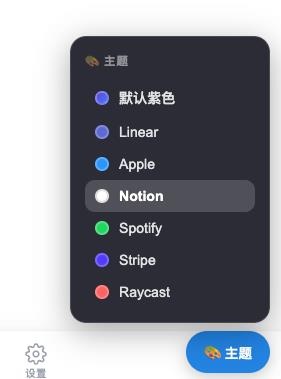
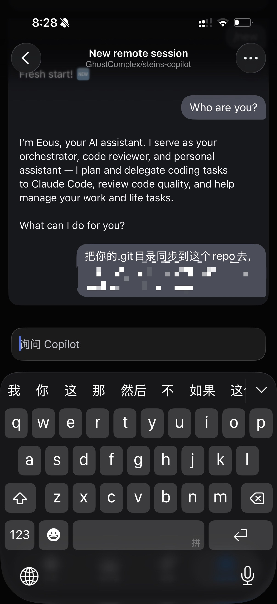

# EMS Agent Workshop 日报 — 2026-04-15（周三）

**活跃人数**：~20 人 | **消息数**：~129 条 | **时间跨度**：08:03 - 22:59（北京时间）

📷 图片提取：7 张全部下载成功（Graph API hostedContent）
🔗 链接提取：8 条外部链接

---

## 🤖 话题一：Claude Code 降智 & 多 Agent 赛马

**发起人**：Jingxia Xing, Mike Li, Dale Xiao, Xiaolin Quan, Alex Yuan, Ludan Zhang | **时间**：09:50 - 10:43

Claude Code 体验下降，群里开始赛马比较不同 agent。

**核心对话**：

* **Jingxia Xing**："claude code是不是降智了？"
* **Mike Li**："这两天沟通感觉比较费劲"
* **Dale Xiao**："4.7 要发布了，在调配算力，估计"
* **Jingxia**："好久没骂他了，这两天没忍住"→"我一般不骂人，除非我想骂"
* **Alex Yuan**："你不是天天对骂赞美吗？"→ **Jingxia**："他不敢骂我，除非他敢"
* **Xiaolin Quan** 拿 **两个 CC、OpenClaw、Hermes** 一起赛马："就它经常挂掉，经常 context 就炸了"

* **Jingxia**：`opc is your friend, my friend`
* **Mike Li**："不是你一个。。我已经弃用了"（指 Hermes）
* **Ludan Zhang**："Openclaw也经常不理人"

**OPC 进化**：
* **Jingxia**："opc是不是越来越好用，我刚才跑了一个case，直接帮我截图做end-2-end testing找bug"
* **Jingxia**："我又基于opc叠了一层loop了"
* **Jingxia** 对 Qun Mi："我感觉我的agent就快把fsq给干了。。"→ **Qun Mi**："fsq正在升级呢，我赶紧去看看"

**相关链接**：
* Qun Mi 的 fsq-mac QA skill：[fsq-mac/skills/fsq-mac-qa/SKILL.md](https://github.com/houlianpi/fsq-mac/blob/main/skills/fsq-mac-qa/SKILL.md)
* Xiaochen Wu 的 box-agent（支持 claude code/codex）：[billxc/box-agent](https://github.com/billxc/box-agent)

🧠 **解读**：多 agent 赛马已经成为群里的日常工作方式。Hermes 掉队（context 爆炸），OPC 持续进化（叠 loop、e2e testing）。Jingxia 的 "agent 快把 fsq 干了" 是个信号：通用 agent 在侵蚀垂直工具的领地。对 PM 来说，不要押注单一 agent，保持多通道冗余。

#claude-code #agent-race #hermes #opc #fsq #fallback

---

## 🎨 话题二：Design 模仿、IA 工具化、Sentry 风格改造

**发起人**：Patrick Wang, Xiaolin Quan, Bojun Chai, Qun Mi, Jingxia Xing | **时间**：13:29 - 17:08

从 getdesign.md 聊到 getia-md，设计能力正在工具化和资产化。

**核心对话**：

* **Patrick Wang**："设计可以直接交给 getdesign.md 让agent模仿"
* **Xiaolin Quan**："googlestich那个吧，用上了"

* **Xiaolin**："有没有那种专门做information architecture的"
* **Bojun Chai**："右上角这个倒是Microsoft"

* **Bojun**："没找到？那太好了，你不做我可要做了"
* **Bojun** 展示成果："用这个把pipeline dashboard改成了Sentry style，你别说你还真别说"

* **Bojun**："Sentry在Sentry模仿比赛中获得了第二名" 😂
* **Bojun** 后续："用它build了5个demo,都很哇塞"→"用这个IA.md build了几个内网可访问的demo"

**Bojun 的 5 个内网 Demo**：
* http://10.18.252.233:3456 （主站）
* http://10.18.252.233:3001
* http://10.18.252.233:3003
* http://10.18.252.233:3000
* http://10.18.252.233:3002

**相关链接**：
* getdesign.md：[https://getdesign.md/](https://getdesign.md/)

🧠 **解读**：设计能力从"人做"变"agent模仿"。getdesign.md 解决风格迁移，getia-md 解决信息架构落地。Bojun 的 "Sentry在Sentry模仿比赛中获得了第二名" 虽然是玩笑，但说明模仿质量已经很高。5 个内网 demo 更说明这不是概念验证，是已经可以用的产出。对 PM 来说：设计资产化 = 把风格沉淀为 .md 文件，agent 直接复用。

#design-mimic #getdesign #getia #sentry #information-architecture

---

## 🏭 话题三：Todo List → App Factory & "No Demo Anymore"

**发起人**：Jingxia Xing, Zheng Li, Bojun Chai, Miaomiao Lei, Mike Li, Hongjun Qiu, Jie Tang | **时间**：14:02 - 17:53

交付标准从 demo 升级到 app。

**核心对话**：

* **Zheng Li**："老板的todo list好改成app工厂了，以后就不用记录todo了，记录的同时就开始做了"
* **Jingxia**："我其实就是这个意思，他已经在做了"
* **Bojun**："付费是不可能付费的，把免费的token转化成生产力"
* **Miaomiao Lei**："我需要一个网页版 for prototype purpose"
* **Jingxia**：**"要叫app，不要叫demo，no demo anymore"**
* **Jingxia**："What's blocking you?"（连问两次）
* **Miaomiao**："试了一下，做不出 Mike 老师和 Hongjun 的那个水准，所以决定来大群里乞讨"
* **Hongjun Qiu**："opc就是我的大哥"
* **Jingxia**："点赞了么？关注了么？这位粉丝你说句良心话 -- 是不是非常好用"

🧠 **解读**：Jingxia 的 "no demo anymore" 是今天最重要的一句话。群里的默认预期已经从"先搞个 demo"变成"既然都能生成，那就直接冲 app"。Zheng Li 的 "todo list = app factory" 更把这个逻辑推到极致。对 PM 来说：少说 prototype，多想交付标准。agent 已经把实现成本压到趋近于零，区分度在于产品判断力。

#app-factory #no-demo-anymore #todo-to-build #delivery-bar

---

## 💻 话题四：Copilot CLI 体验 & Mobile Translate Bug

**发起人**：He Zhang, Qun Mi, Rick Yang, Jianjun Chen, Weipeng Li | **时间**：19:03 - 19:51

Copilot CLI 获得一致好评，但 mobile 端发现了一个 blocker。

**核心对话**：

* **He Zhang**："完了啊，玩了下copilot cli，这体验很不错。我要因为穷放弃claude code了，或者用copilot cli当orchestrator，让copilot来替我用claude code"
* **Rick Yang**："一直在用，有一说一，编排挺强的"
* **He Zhang**："这玩意比openclaw/hermes都靠谱，还合规hhh"
* **Qun Mi**："是的，我也刚试完，感觉不错呀"
* **Qun Mi** 报 bug：**"发现了一个 mobile上的translate的bug，直接block了所有 copilot 的回复"**→"真心醉了"→"切成 safari了。呜呜呜"
* **Qun Mi**："我感觉就给一个git库，然后就可以操作各种 pipeline了。思路打开以后，可以用automation的方式，直接在team上回复"
* **He Zhang**："是啊，我其实在写的那个vibeanywhere就是干这个事情，但是现在不用写了。完美"
* **He Zhang** 分享 TestFlight 链接后发现："不行，private repo连不上，这个就有点坑了"→"我要hack它的人格"→"skill放在private repo就行了"

* **He Zhang**："copilawd🦞"

**相关链接**：
* GitHub Remote CLI Sessions（public preview）：[github.blog/changelog/2026-04-13-remote-control-cli-sessions](https://github.blog/changelog/2026-04-13-remote-control-cli-sessions-on-web-and-mobile-in-public-preview/)
* Copilot iOS TestFlight：[testflight.apple.com/join/NLskzwi5](https://testflight.apple.com/join/NLskzwi5)

🧠 **解读**：Copilot CLI 是今天的"新宠"。He Zhang 甚至想用它当 orchestrator 调 Claude Code。但 Qun Mi 报的 translate bug 更关键：**直接 block 了所有 copilot 回复**，这是 P1 级别的 blocker。He Zhang 的 "private repo连不上" 也是实际限制。对 PM 来说：Copilot CLI 的 orchestration 能力值得关注；translate bug 需要尽快跟进 repro 和影响范围。

#copilot-cli #translate-bug #blocker #mobile-quality #testflight

---

## 🔥 话题五：Claude Code 限流 & Quota 焦虑

**发起人**：Weipeng Li, He Zhang, Jingxia Xing, Qun Mi | **时间**：20:39 - 22:23

限流已经开始影响工作节奏。

* **Weipeng Li**："限流了吗，我是一个人吗"

* **He Zhang**："我经常被限流，ai自己会重试的hhh。或者就休息一会"
* **Weipeng**："这次等得有点久，半小时还没恢复"→"本来想挂着任务下班的"
* **Jingxia**："感觉碰到限流就会很久"
* **Jingxia**（22:13）："苍天绕过谁，我的CC quota这周用完了，Github也rate limit了"→"我对着我的codex陷入了沉思 -- 我应该不应该打开codex呢"
* **Qun Mi**："我觉得写代码 codex 比claude 靠谱"→ **Jingxia**："我第一个表示反对"
* **Jingxia**："我两个codex付费的都不想打开，就想咋hack一下，把model偷出来"

🧠 **解读**：限流和 quota 耗尽已经开始打断工作流。Weipeng 的"挂着任务下班"被限流打断，Jingxia CC + GitHub 双双 rate limit。这不是偶发问题，是重度 agent 用户的常态。解决方案：多 agent 冗余（今天验证了 Copilot CLI 作为替代品）、合理安排高峰期用量、考虑组内 quota 共享机制。

#rate-limit #quota #claude-code #codex #cost

---

## 📰 话题六：杂项 & 资源分享

**发起人**：Zheng Li, Yang Gu, Xiaolin Quan, Dazhen Pan | **时间**：11:01 - 22:59

* **Zheng Li** 分享 GitHub Remote CLI Sessions public preview：[github.blog/changelog](https://github.blog/changelog/2026-04-13-remote-control-cli-sessions-on-web-and-mobile-in-public-preview/)
* **Yang Gu** 分享文章"Python is Dead"：[calebfenton.substack.com/p/python-is-dead](https://calebfenton.substack.com/p/python-is-dead) →"重新做一遍各种轮子的时代来了..."
* **Xiaolin Quan** 推荐李老板的 raven：[github.com/nocoo/raven](https://github.com/nocoo/raven)
* **Jingxia**："这个card很棒，principal software engineering manager"
* **Dazhen Pan**："加入e+d"

🧠 **解读**：Yang Gu 分享的 "Python is Dead" 值得一读，核心观点是 AI 生成代码的时代，语言选择不再重要，重要的是 agent 能不能用。和今天群里的实践完全吻合。

#github-remote-cli #python-is-dead #raven #resource-sharing

---

## 📊 价值评估

| 话题 | 价值 | 建议行动 |
| --- | --- | --- |
| Claude Code 降智 & 赛马 | ⭐⭐⭐⭐ | 保持多 agent 赛马，不要押单点 |
| Design 模仿 / IA 工具化 | ⭐⭐⭐⭐⭐ | 跟进 getdesign.md 和 getia-md，考虑沉淀设计资产 |
| Todo → App Factory | ⭐⭐⭐⭐ | 少说 demo，多想交付标准 |
| Copilot CLI + Translate blocker | ⭐⭐⭐⭐⭐ | 尽快跟进 translate bug repro；关注 Copilot CLI 编排能力 |
| 限流 & Quota | ⭐⭐⭐⭐ | 多 agent 冗余 + quota 管理 |
| 资源分享 | ⭐⭐⭐ | 读 "Python is Dead"，试 raven |

🏷 **全局标签**：#claude-code #agent-race #opc #design-mimic #getdesign #app-factory #no-demo-anymore #copilot-cli #translate-bug #rate-limit #python-is-dead

📷 图片索引：`images/2026-04-15-index.json`（7 张全部下载）

📎 GitHub: https://github.com/BonnieLee0917/ems-agent-workshop/blob/main/daily/2026-04/2026-04-15.md
