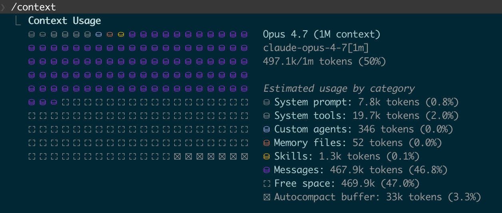
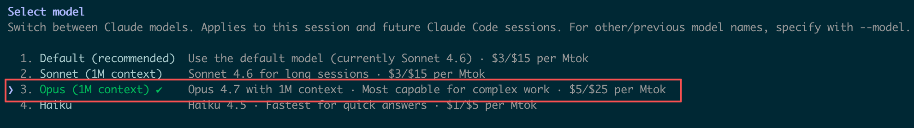
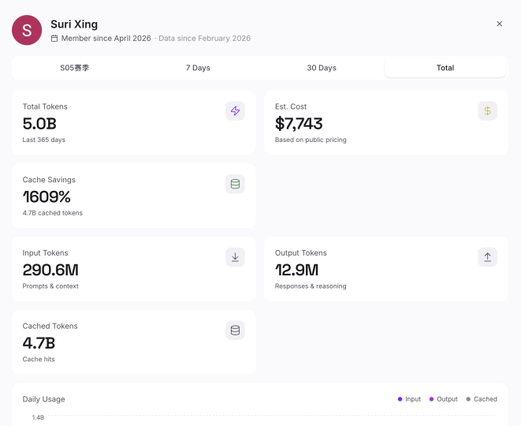
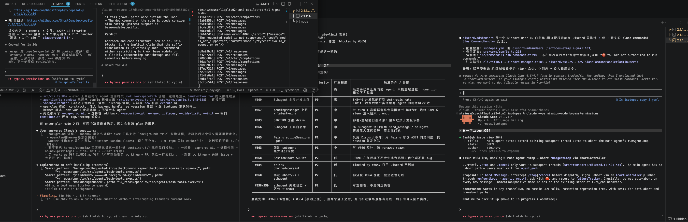
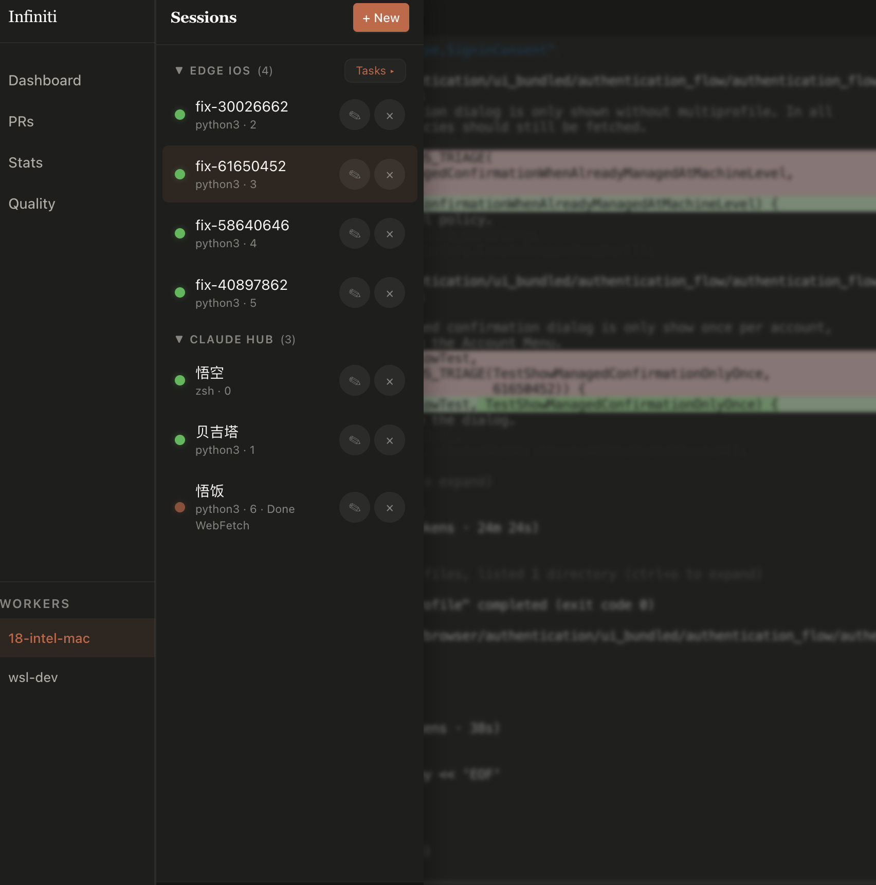
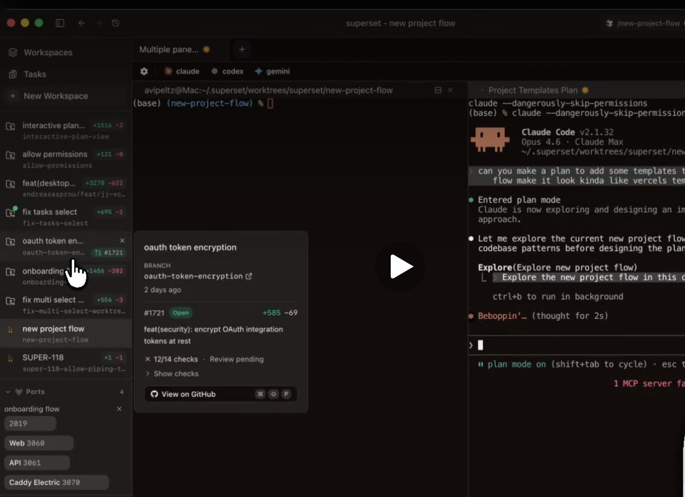

# EMS Agent Workshop 日报 — 2026-04-18（周六）

**活跃人数**：9 人 | **消息数**：36 条 | **时间跨度**：00:57 - 23:58（北京时间）

📷 图片：6 张 | 🔗 链接：2 条

---

## 🦞 话题一：龙虾 / Claw 1.0 权限开放预告

**发起人**：Dazhen Pan, Coraline Gao, Jingxia Xing, He Zhang | **时间**：00:57 - 12:55

- **Dazhen Pan**（00:57）：repo 404
- **Coraline Gao**（07:13）：我来给大家加一下权限
- **Jingxia Xing**：赞啊，这个咋做到合规的？不是真 🦞 对吧？
- **Coraline Gao**（10:07）：**不是 openclaw**。1.0 是用的 workpilot 的核，他们自己撸的虾，后面版本会换掉然后加上我们 team 的 skills 加上 agency mcp 接通微软能力
- **Jingxia Xing**：求分享、求 md
- **He Zhang**：tql，求权限
- **Coraline Gao**（12:55）：等下周一 Xiaochun Zhao 给大家加权限哈

🧠 **解读**：这次的 1.0 是 workpilot 核 + 自研，合规路径清晰。后续换核 + 接 team skills + agency mcp，才是真正要做的那一步。短期是产品，长期是微软能力的分发通道。

#claw #workpilot #mcp #agency #skills

---

## 🎨 话题二：Claude Design 上线 + 买家秀 vs 卖家秀

**发起人**：Dale Xiao, Dazhen Pan, He Zhang | **时间**：07:28 - 23:25

- **Dale Xiao**（07:28）：[claude.ai/design](http://claude.ai/design) 出来了，现在明白了 opus 4.7 为啥专门大幅提升视觉能力了。Claude 真的是围绕数字工作这个生态，一个垂类一个垂类地打啊，坚定又专注，钝刀子割肉
- **Dale Xiao**（22:42）：Claude Design 系统提示词 → [GitHub - Claude-Design-Sys-Prompt](https://github.com/elder-plinius/CL4R1T4S/blob/main/ANTHROPIC/Claude-Design-Sys-Prompt.txt)
- **Dazhen Pan**（23:11）：昨天尝试用 Claude Design 改造一个已有项目，design 看着挺美，但本地 CC 能力不足，最后变成了买家秀和卖家秀

🧠 **解读**：Claude Design 解决"怎么看"，本地 CC 解决"怎么做"。两端没对齐就是买家秀。Anthropic 这个垂类打法能复制到其他场景，是真正值得关注的产品策略。

#claude-design #opus-4.7 #买家秀 #系统提示词

---

## ⚡ 话题三：Opus 4.7 的 200k vs 1M 之谜

**发起人**：Menci, Jingxia Xing, Jacky Zeng | **时间**：16:56 - 22:40

- **Menci**：感觉 4.7 这个 200k 啥都不够干呀，讨论几轮设计方案就满了，compact 一下又忘细节；你们是用 4.7 还是 1m 的 4.6
- **Jingxia Xing**：我正在考虑切回去；他自己都发现了，跟我复盘说 compact 太多次目标偏移
- **Jacky Zeng**（18:30）：实测了一下应该是 1M 的啊

- **Jingxia**：你的 setting 是啥样的？难道不同的 flight？
- **Jacky Zeng**（19:05）：可能是，CLI 里有这个 1M 的选项（Claude CLI version: 2.1.112）

- **Jingxia Xing**（22:40）：看看这 cache savings，这个才是正经干活的

🧠 **解读**：200k 还是 1M 不是版本差异，是 CLI flight/setting 差异。这条线索直接通向 4/20 那个 "header filter + context-1m" 的完整解决方案，今天这里是伏笔。

#opus-4.7 #200k #1m #cli #flight

---

## 🖥 话题四：多 CC 会话工作流（tmux / cmux / superset）

**发起人**：He Zhang, Dazhen Pan, Jingxia Xing, Weipeng Li | **时间**：23:20 - 23:58

- **He Zhang**（23:20）：工作流搬运到了 cc 上了，满屏幕的窗口，下周试试 cumx 好不好用

- **Dazhen Pan**：tmux 挺好的，我现在基本固定这套了，不同项目用不同 window，同一个项目 window 内用 pane 分割
- **He Zhang**：这样干活 vscode 是没啥用了，我根本不知道当前文件在哪个 worktree，不如直接去看 pr
- **Dazhen Pan**：基本不看，非要看就 code . 一下，看完即走
- **Jingxia Xing**：superset 试试
- **He Zhang**：我得去搞一下我的 tmux 了，至少搞个 default pannel 布局，一键 spawn 我的开发小队 tmux 版
- **Dazhen Pan**：ghostty + tmux，真香
- **Dazhen Pan**：还是年轻人啊，我现在折腾好一套除非有很大提升，基本就不动了
- **Weipeng Li**（23:58）：我刚看到 superset 的时候都吓了一跳，和我自己基于 tmux 为 edge 搓的工作流 UI 非常相似。看来现在同时处理多个 CC 会话已经是刚需了

🧠 **解读**：多 CC 会话并发已经从 hacker 玩法变成日常刚需。VSCode 在这种模式下甚至是累赘。superset / tmux / cmux 的出现说明 agent 并发管理会是下一个工具品类。

#tmux #cmux #ghostty #superset #multi-cc #并发工作流

---

## 📊 价值评估

| 话题 | 价值 | 建议行动 |
| --- | --- | --- |
| Claw 1.0 权限开放 | ⭐⭐⭐⭐ | 周一找 Xiaochun 加权限 |
| Claude Design 上线 | ⭐⭐⭐⭐⭐ | 试用，对比本地 CC 能力差距 |
| Opus 4.7 200k vs 1M | ⭐⭐⭐⭐ | 验证 CLI 版本，确认自己是哪个 flight |
| 多 CC 并发工作流 | ⭐⭐⭐⭐⭐ | 评估 superset，考虑 tmux 化 |

🏷 #claw #claude-design #opus-4.7 #1m-context #superset #tmux #multi-cc

📎 GitHub: [2026-04-18.md](https://github.com/BonnieLee0917/ems-agent-workshop/blob/main/daily/2026-04/2026-04-18.md)
