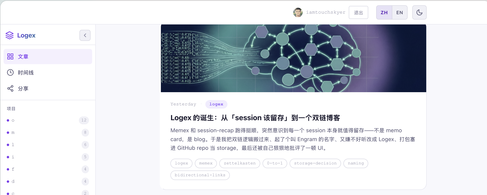

# 📋 EMS Agent Workshop 日报 — 2026-04-19（周六）

**活跃人数**：5 人 | **消息数**：15 条 | **时间跨度**：00:01 - 23:02（北京时间）

📷 图片：3 张（Graph API 下载成功） | 🔗 链接：3 条

> 周六消息量不大，但 Jingxia 发了一个新产品 + Opus 4.7 context 问题继续发酵。

---

## 🚀 话题一：Logex 上线 — Agent Session 变博客文章

**发起人**：Jingxia Xing, Yue Liu | **时间**：21:33 - 22:33

Jingxia 发布了 memex 的兄弟产品 **Logex**：把 Claude Code session transcript 自动转成博客风格文章。

**核心信息**：

* **定位**：memex 记录知识卡片，logex 记录你和 agent 的 session 回忆录
* **安装**：`npm install -g @touchskyer/logex`
* **代码**：[GitHub - iamtouchskyer/logex](https://github.com/iamtouchskyer/logex)
* **Web 端**：[logex-io.vercel.app](https://logex-io.vercel.app/)
* **案例**：[session 分享示例](https://logex-io.vercel.app/#/share/uJuxmlZhdwZM)



**Yue Liu** 发现和自己的项目撞车了，但 logex 的 parse/chunk 部分可以借鉴。Jingxia："拿去，记着 star + watch"。


🧠 **解读**：Agent session 是最被低估的知识资产。大家每天和 agent 对话几十轮，但 session 结束就消失了。Logex 把这些对话变成可检索、可分享的文章，本质是在做 agent 时代的"工作日志"。对 PM 来说，这比手写周报有价值得多。

#logex #memex #agent-session #knowledge-management

---

## ⚡ 话题二：Opus 4.7 Context 200k vs 1M 持续发酵

**发起人**：Jingxia Xing, Dazhen Pan, Menci, Jacky Zeng, Yue Liu | **时间**：22:01 - 23:02

接上周讨论，Opus 4.7 的 compact 问题继续引发吐槽。

* **Jingxia**："4.7 为啥这么在乎 compact？快要 compact 了就要停下来提醒我要不要重启。对 YOLO 非常不友好"
* **Dazhen**："1m 要 compact，搞这么大飞机"
* **Menci**："我们的只有 200k……不知道公司搞的什么幺蛾子，4.7 只有 200k"、"所以用着用着需求没讨论完就 compact 了"
* **Jacky Zeng**："你看看你的版本？我这个版本有"（暗示版本差异导致 context 不同）
* **Yue Liu** 给出解法：CP 了 Jacky 的 commit 魔改出 1M 接口
  ```
  export ANTHROPIC_MODEL='claude-opus-4.7[1m]'
  export CLAUDE_CODE_EXTRA_BODY='{"thinking":{"type":"adaptive"}}'
  export CLAUDE_CODE_EFFORT_LEVEL='max'
  ```

🧠 **解读**：200k vs 1M 不是 bug，是公司内部不同版本/SKU 的差异。Jacky 的版本有 1M，标准版只有 200k。Yue Liu 的魔改方案说明 1M 接口存在，只是没开放。对日常开发，200k compact 确实是大痛点。建议关注 Jacky 版本的来源，看能否通过正规渠道拿到 1M。

#opus-4.7 #context-window #compact #1m-context

---

## 🛠 话题三：Superset Bug + 三栏布局趋势

**发起人**：Jingxia Xing, Dazhen Pan | **时间**：00:01 - 00:12

深夜尾声讨论（承接 4/18 话题）。

* **Jingxia**："superset 还有一个 bug，对中文支持有问题"、"你也可以贡献进去，算点工分"


* **Dazhen**："Codex 和 claude code desktop 也是这种三栏样式的"

🧠 **解读**：三栏布局（代码/对话/预览）正在成为 AI coding 工具的标准范式（Codex、Claude Code Desktop、Cursor）。Superset 的中文 bug 值得报一下，尤其如果要在国内推。

#superset #三栏布局 #中文支持

---

## 📊 价值评估

| 话题 | 价值 | 建议行动 |
| --- | --- | --- |
| Logex 上线 | ⭐⭐⭐⭐⭐ | 试用 logex，评估能否整合到团队工作流 |
| Opus 4.7 Context | ⭐⭐⭐⭐ | 跟进 1M 版本来源，看能否团队统一升级 |
| Superset 中文 Bug | ⭐⭐⭐ | 确认 bug 详情，考虑提 PR |

🏷 **全局标签**：#logex #memex #opus-4.7 #context-window #1m-context #superset #三栏布局

📎 GitHub: [2026-04-19.md](https://github.com/BonnieLee0917/ems-agent-workshop/blob/main/daily/2026-04/2026-04-19.md)
