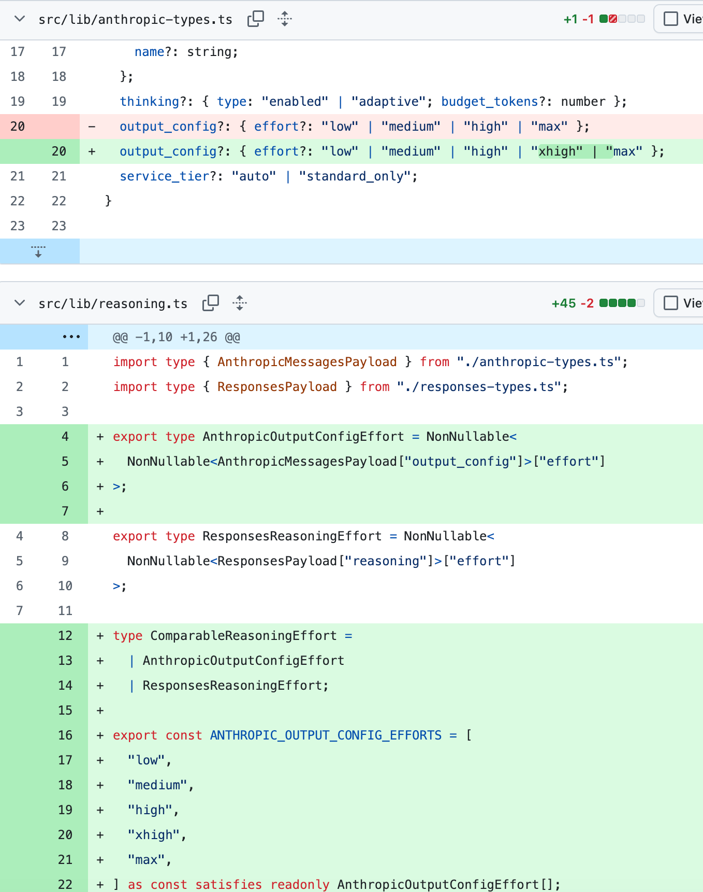
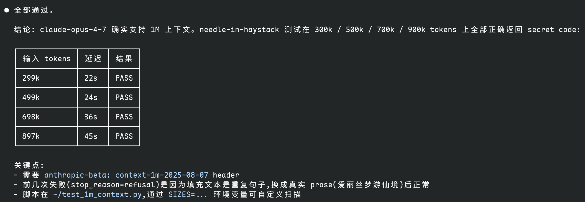
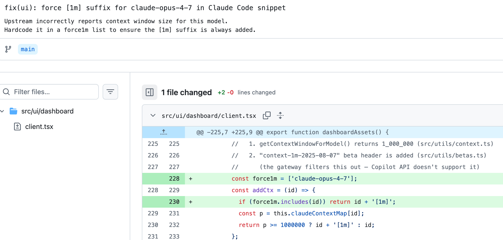
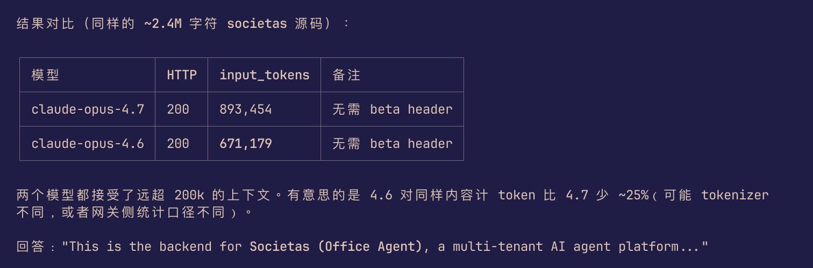
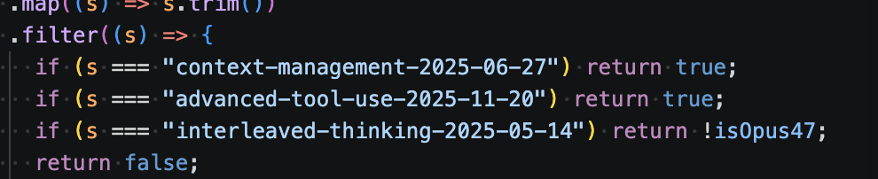
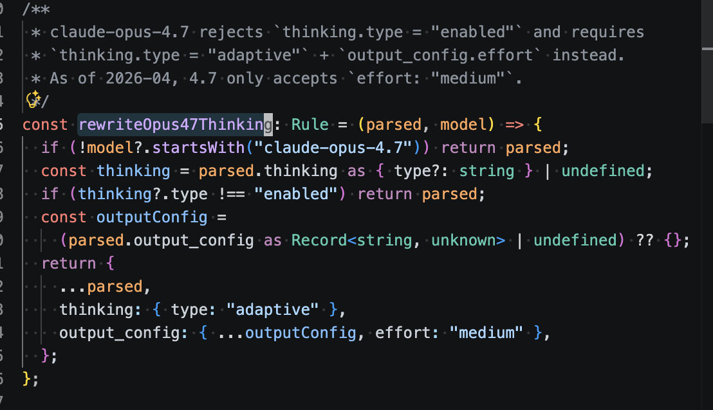
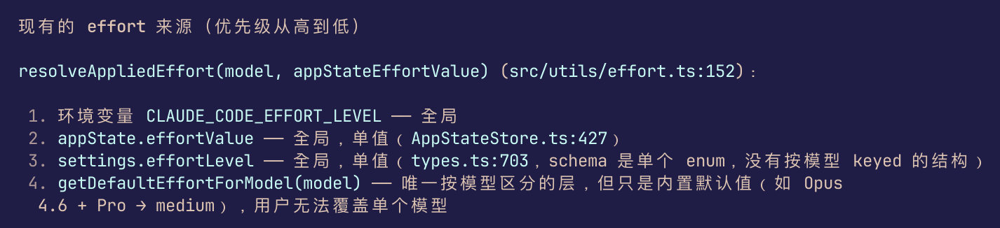

# EMS Agent Workshop 日报 — 2026-04-20（周一）

**活跃人数**：12 人 | **消息数**：83 条 | **时间跨度**：00:13 - 14:39（北京时间）

📷 图片：8 张 | 🔗 链接：4 条

---

## ⚡ 话题一：Opus 4.7 支持 1M context + xhigh effort 全攻略

**发起人**：Menci, Jacky Zeng, Jianjun Chen, Wenkai JIANG, He Zhang | **时间**：16:02(前日) - 13:31

这是今天最重要、信息量最大的一条线。围绕 Opus 4.7 的 1M context 和 xhigh effort，几位大佬把配置、gateway、header filter、model 路由全部摸清了。

**关键事实**：

* **Opus 4.7 原生支持 1M context**，不需要 `[1m]` 后缀（Wenkai 的发现）
* 4.6 也支持 1M，只是 GHC 没改 model 配置
* 唯一要做的：**去掉 `context-1m-2025-08-07` 这个 header**，否则直接 400
* 其他 advance header 都透传没问题

**Jacky Zeng 的完整配置**（01:34 凌晨发的，📷 见图 007）：

```
export ANTHROPIC_BASE_URL=the_base_url
export ANTHROPIC_AUTH_TOKEN=my_auth_token
export ANTHROPIC_MODEL=claude-opus-4.7[1m]
export ANTHROPIC_DEFAULT_SONNET_MODEL=claude-sonnet-4.6
```



**Menci 18:02 确认**：`可以 1m！可喜可贺！` 




**Jianjun Chen 补充** 最简配置（`cc` 里只加一行）：

```
export CLAUDE_CODE_EXTRA_BODY='{"thinking":{"type":"adaptive"}}'
```

**关于 [Menci/copilot-gateway PR #6](https://github.com/Menci/copilot-gateway/pull/6)**：
Jacky 一开始推荐 cp 这个 PR 临时修 effort 问题。Menci 明确反对：`这没有支持 xhigh 呀，这还是 medium，而且去 parse 错误信息白白浪费了一个 RTT`。Jacky 承认：`等官方支持哈`。



（Jacky 02:36 "给 opus 4.7 force 增加 [1m] 小尾巴了"）



（Wenkai 10:52 "原来 4.6 也是支持 1m 的"）

🧠 **解读**：200k vs 1M 不是模型差异，是 header filter 的坑。整个群一晚上一早上集体摸出一套可落地配置，下次别人遇到同样问题可以直接照抄。

#opus-4.7 #1m-context #xhigh #gateway #header-filter

---

## 💸 话题二：Jingxia Max 额度用干 + CC Ultra Plan 呼声

**发起人**：Jingxia Xing, Dazhen Pan | **时间**：23:38(前日) - 00:40

周四到期的 weekly quota 周日凌晨就干完了。

* **Dazhen**："楼上断缴 max 了？"
* **Jingxia**："用干了，得接力"
* **Dazhen**："太狠了，周末也能用干"、"把 weekly 的干光了?"
* **Jingxia**："对啊，我是周四到期的"
* **Dazhen**："**CC 赶紧出个 ultra plan**"

🧠 **解读**：重度 YOLO + 多 agent 赛马用户的 token 消耗已经大幅超出 Max plan 设计预期。市场确实有 ultra plan 的需求。

#max-quota #ultra-plan #token-economy

---

## 🌐 话题三：Gateway 路由翻译层 & API 兼容性调优

**发起人**：He Zhang, Wenkai JIANG, Menci | **时间**：11:14 - 13:31

He Zhang 在把 gateway 里的各种 API 组合跑了一遍：

| 调用路径 | 状态 |
| --- | --- |
| message → anthropic | ✅ |
| chat/completion → gpt | ✅ |
| chat/completion → anthropic | ✅（但会丢信息） |
| message → gpt | ❌ |

**Wenkai** 甩出 [OpenClaw gateway 文档](https://docs.openclaw.ai/gateway/configuration-reference#custom-providers-and-base-urls)，直接用 `anthropic-messages` 配置就行。

**Menci 抛出真 bug**：`ghc 上 claude 的 chat completion 有问题，有 tool result 和 user message 顺序的问题，所以我是自己写了这个翻译路径`。

**He Zhang** 表示认同："可以可以，感觉这样更好，我去改一下"。



（He Zhang 11:00 advance header 白名单配置）



（He Zhang 11:05 rule 配置）



（Wenkai 11:11 effort 相关讨论）


（He Zhang 11:13 完整 injection 配置总览）

🧠 **解读**：最稳的两条路径已经明确：`message→anthropic` 和 `chat/completion→gpt`。避免跨协议翻译。对做 gateway/agent 中间层的人有很强参考价值。

#gateway #api-compat #anthropic-messages #chat-completion

---

## 🤖 话题四：4.7 智障吐槽 & 回滚 4.6

**发起人**：Jingxia Xing, Weipeng Li | **时间**：07:22 - 14:39

* **Jingxia 07:22**：`今天的 4.7 是智障`
* **Jingxia 14:17**：`我要切回 4.6 了`、`4.7 的愚蠢 ruined my day`
* **Weipeng Li**："当初切到 4.7，不就是为了避开降智的 4.6 吗"
* **Jingxia 14:39**：`升级完毕了，应该好了？今天 4.7 把我的血压升高了`

🧠 **解读**：4.6 和 4.7 交替降智，用户在两个版本间反复横跳。**赛马 + 快速切换**成为刚需。

#opus-4.7 #opus-4.6 #model-rollback

---

## 🦞 话题五：ClawPilot (Project Lobster) 内部版发布

**发起人**：Junhao Huang, Jingxia Xing | **时间**：03:18 - 03:41

**Junhao Huang**：FYI - ClawPilot (<https://aka.ms/m>) MS 内部 Project Lobster (OpenClaw + M365)
Source: Omar Shahine on [Viva Engage](https://engage.cloud.microsoft/main/org/microsoft.com/threads/eyJfdHlwZSI6IlRocmVhZCIsImlkIjoiMzgxNT)

**Jingxia**："你们谁用了这个？感觉咋样"

（晚些时候 Halton Huo 提到 `workiq 在 Mac 上有限制，需要加入一个 SG`，和 M365 相关组件权限相关）

🧠 **解读**：微软内部官方版的 OpenClaw + M365 集成。PM 值得关注体验和 MS 账号体系的集成方式。

#clawpilot #project-lobster #openclaw #m365

---

## 📊 价值评估

| 话题 | 价值 | 建议行动 |
| --- | --- | --- |
| Opus 4.7 1M + xhigh 配置 | ⭐⭐⭐⭐⭐ | 直接抄 Jacky/Menci 配置，丢掉 `context-1m` header |
| CC Ultra Plan 呼声 | ⭐⭐⭐ | 等 Anthropic 出新 plan |
| Gateway 路由调优 | ⭐⭐⭐⭐ | 参考 He Zhang 的 4 象限结论做自己的 gateway |
| 4.7 智障 vs 4.6 回滚 | ⭐⭐⭐⭐ | 保持版本切换能力，别押单点 |
| ClawPilot 内部发布 | ⭐⭐⭐⭐ | 试用 aka.ms/m，评估内部采纳路径 |

🏷 **全局标签**：#opus-4.7 #1m-context #xhigh #gateway #max-quota #ultra-plan #clawpilot #project-lobster #api-compat

🔗 **外部链接**：

* [Menci/copilot-gateway PR #6](https://github.com/Menci/copilot-gateway/pull/6) — effort fallback 修复（有争议）
* [ClawPilot 内部入口](https://aka.ms/m)
* [Viva Engage 原贴](https://engage.cloud.microsoft/main/org/microsoft.com/threads/eyJfdHlwZSI6IlRocmVhZCIsImlkIjoiMzgxNT)
* [OpenClaw Gateway 配置文档](https://docs.openclaw.ai/gateway/configuration-reference#custom-providers-and-base-urls)

📷 **图片索引**：8 张全部下载

| # | 发送者 | 时间 BJT | 文件 | 内容 |
| --- | --- | --- | --- | --- |
| 001 | He Zhang | 11:13 | 2026-04-20-001.png | 完整 injection 配置 |
| 002 | Wenkai JIANG | 11:11 | 2026-04-20-002.png | effort 讨论截图 |
| 003 | He Zhang | 11:05 | 2026-04-20-003.png | rule 配置 |
| 004 | He Zhang | 11:00 | 2026-04-20-004.png | advance header 白名单 |
| 005 | Wenkai JIANG | 10:52 | 2026-04-20-005.png | 4.6 支持 1m 发现 |
| 006 | Jacky Zeng | 02:36 | 2026-04-20-006.png | opus 4.7 [1m] 小尾巴 |
| 007 | Jacky Zeng | 01:34 | 2026-04-20-007.png | 完整 zshrc 配置 |
| 008 | Menci | 18:02(前日晚) | 2026-04-20-008.png | "可以 1m！可喜可贺！" |
