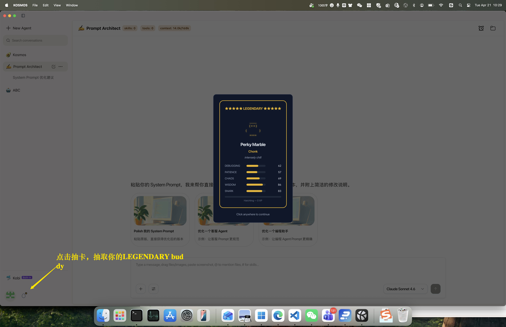
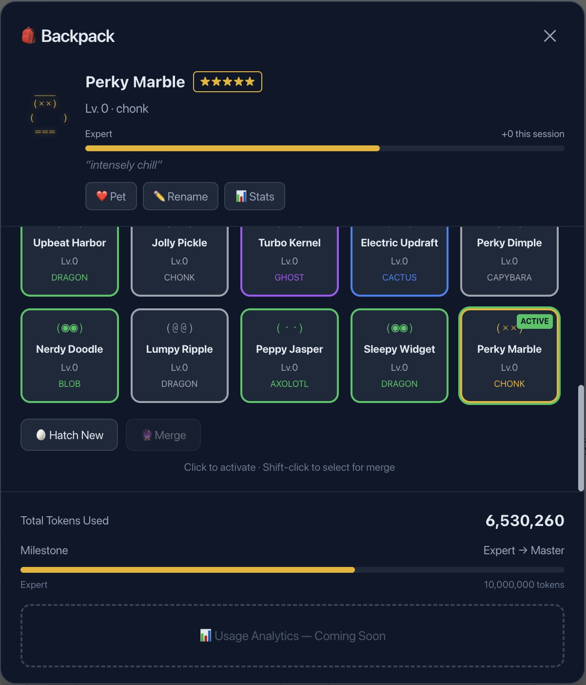
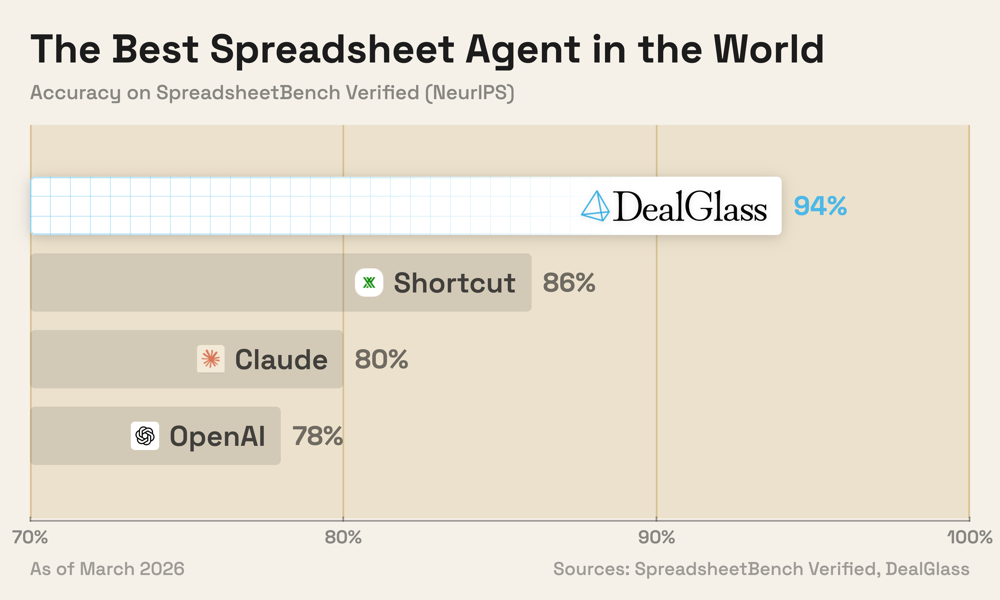
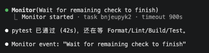
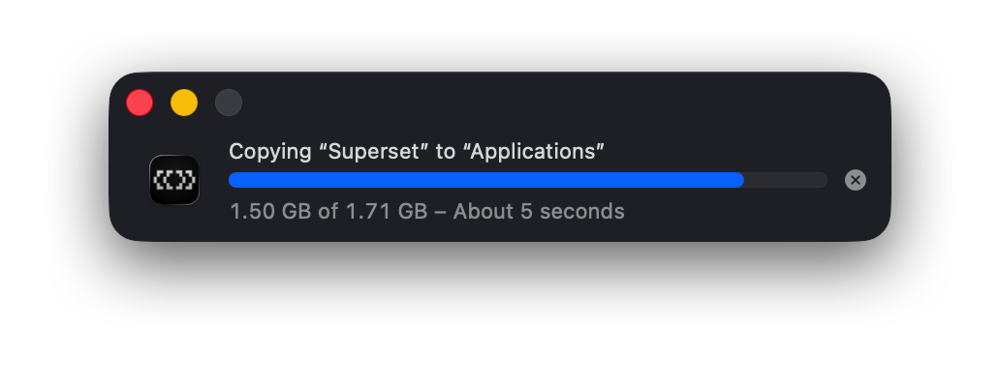

# EMS Agent Workshop 日报 — 2026-04-21（周二）

**活跃人数**：13 人 | **消息数**：44 条 | **时间跨度**：10:19 - 20:03（北京时间）

📷 图片：5 张 | 🔗 链接：3 条

---

## 🎮 话题一：PM Studio / Kosmos "电子宠物 Buddy" 上线刷屏

**发起人**：Yang Huangfu, Juntong Liu, Jingxia Xing, Scott Wei, He Zhang, Dale Xiao, Jiajun Yan | **时间**：10:42 - 10:58

Yang Huangfu 一早泄露预警：PM Studio / KOSMOS 出了个电子宠物 Buddy，18 个种族 · 5 阶稀有度，用 Token 喂养 "陪你一路走向 AGI"。群里秒刷屏。

**下载体验**：[aka.ms/pmstudio](https://aka.ms/pmstudio) ｜ [kosmos-ai.com](https://www.kosmos-ai.com)

**群里梗话节选**：
- **Scott Wei**：据说是抄 CC 的，Jingxia 这资深 CC 用户没有养？
- **Jingxia Xing**：没有，我都是干正经事的 → 这个我让 Suri 去玩吧
- **Jingxia Xing**：CC 下一步一定是 OS 的入口了，这个 buddy 对标 Anthropic 的 Mico
- **Yang Huangfu**：确实是抄 CC，哈哈哈哈
- **Juntong Liu**：抄 → 致敬
- **He Zhang**：请务必加上种族值、努力值、pvp 系统；全服前 0.01%；根据使用 token 量来排榜一
- **Dale Xiao**：有没有氪金皮肤 → **Juntong Liu**：得加钱
- **Jingxia Xing**：为了部落！
- **Scott Wei**：暴露年龄…En taro Tassadar → **Jiajun Yan**：En taro Adu
- **Jingxia Xing**：我们年轻人看不懂你们在说啥

🧠 **解读**：从"工具产品"到"陪伴型 agent"，Kosmos Buddy 把 token 消耗做成游戏化激励。关键 insight 是 Jingxia 那句"CC 下一步一定是 OS 的入口"——agent 从工具 → 桌面常驻 → 人和系统之间的 layer。

#kosmos #pm-studio #buddy #电子宠物 #agent-as-os

---

## 🧠 话题二：OPC 大升级 + Jingxia 公众号分享

**发起人**：Jingxia Xing, Michael Fei | **时间**：10:19 - 10:42

- **Jingxia Xing**：最近 opc 又做了一次很大的升级，agent 和我的感悟都在 [这篇公众号](https://mp.weixin.qq.com/s/kXVn37aS86TxWU1cdoVtWQ)
- **Jingxia**：愿意自己折腾的强烈建议自己折腾一遍，很多坑自己不踩是没有体感的；没时间的就用 opc 好了
- **Michael Fei**：你后来切换回 4.6 了么？ → **Jingxia**：昨晚说完就切了，今天宾主尽欢

🧠 **解读**：Jingxia 昨天对 4.7 还抱希望，今天直接切回 4.6。这是实践派的选择：效果优先，不为新版本背书。

#opc #升级 #公众号 #4.6回滚

---

## ⚡ 话题三：Opus 4.7 体验滑坡，多人切回 4.6

**发起人**：Weipeng Li, Bojun Chai, Cathy Chen, He Zhang | **时间**：14:09 - 14:16

- **Weipeng Li**：也放弃愚蠢的 4.7，切回 4.6 了。4.7 不光推理能力倒退，还有个要命点是它似乎在模仿 CodeX 的语义输出方式，但复杂情况下逻辑混乱、表述不清
- **Bojun Chai**：opencode 里面的 4.7 感觉丝滑 & 聪明，不知为何；claude code 里的让人想拿啤酒瓶子拍它
- **Cathy Chen**：mode 不一样？
- **He Zhang**：没能感觉到区别；不过我的代理走的是透传，只把会导致它挂掉的 request 内容干掉，其他不动，不知道是不是有什么奇奇怪怪的配置项

🧠 **解读**：同一个 4.7 在 OpenCode 丝滑、在 Claude Code 让人想拍桌子——强烈暗示 CC 侧做了额外的 system prompt / context filter。He Zhang 的透传代理无差异，进一步佐证问题出在 client 端包装。

#opus-4.7 #4.6回滚 #opencode #claude-code #客户端差异

---

## 📊 话题四：DealGlass Tetra "世界最强 Spreadsheet Agent" 评测

**发起人**：Zhiyuan Zheng, Scott Wei | **时间**：15:25 - 15:27

- **Zhiyuan Zheng**：一家创业公司 DealGlass 上个月发布了 "The best spreadsheet agent in the world" 的 Agent Tetra — [Introducing Tetra | DealGlass Research](https://dealglass.com/tetra/)
- **Scott Wei**：@Jingxia @Zhiyuan 他这个测评咱们是多少分？
- **Zhiyuan Zheng**：**46%**，主要丢分的部分在于 VBA/Macro 和 Array Formula。图上 Claude→Opus 4.6，OpenAI→GPT-5.4

- **Scott Wei**：任重而道远

🧠 **解读**：Spreadsheet agent 是个被低估的垂直赛道。46% 意味着日常报表能跑，但 VBA/Macro/Array Formula 这些企业级场景还差很远。这正是 Excel 用户最在乎的那 50%。

#spreadsheet-agent #tetra #dealglass #评测

---

## 🎯 话题五：CC 新功能首次触发

**发起人**：He Zhang, Jingxia Xing | **时间**：16:41 - 20:03

- **He Zhang**：cc 还是强啊，第一次触发这个功能；这个很好用啊

- 17:57 He Zhang 补一张："试图跟上年轻人的步伐"

- **Jingxia Xing**（20:03）：好用

🧠 **解读**：CC 的新功能触发和反馈。群里默认把新功能试一遍已经成为日常。

#claude-code #新功能

---

## 📊 价值评估

| 话题 | 价值 | 建议行动 |
| --- | --- | --- |
| Kosmos Buddy 上线 | ⭐⭐⭐⭐ | 试用，评估 agent-as-OS 入口趋势 |
| OPC 升级 + Jingxia 分享 | ⭐⭐⭐⭐⭐ | 读完公众号，对照自己的工作流 |
| 4.7 切回 4.6 潮 | ⭐⭐⭐⭐ | CC 客户端侧的 context 处理值得深挖 |
| DealGlass Tetra 评测 | ⭐⭐⭐⭐ | 关注 spreadsheet agent 赛道 |
| CC 新功能 | ⭐⭐⭐ | 试用 |

🏷 #kosmos #buddy #opc #opus-4.7 #4.6回滚 #tetra #spreadsheet-agent #claude-code

📎 GitHub: [2026-04-21.md](https://github.com/BonnieLee0917/ems-agent-workshop/blob/main/daily/2026-04/2026-04-21.md)
