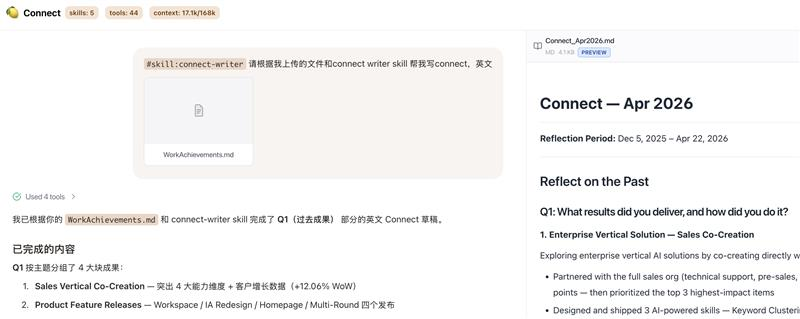
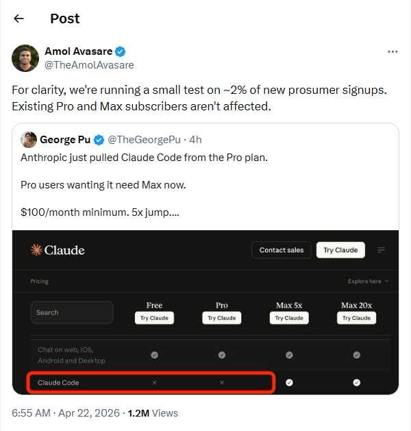
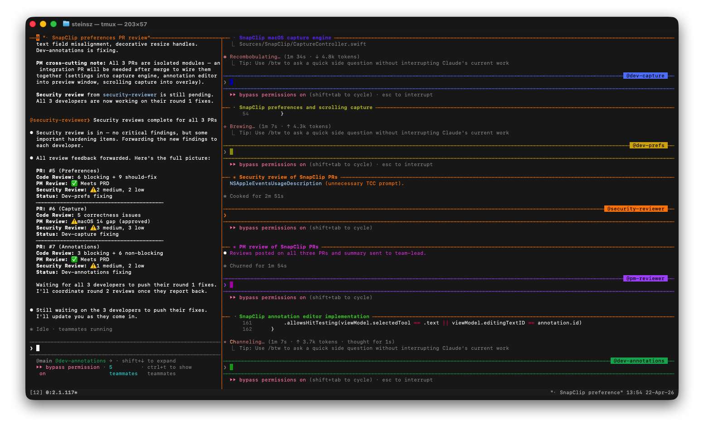
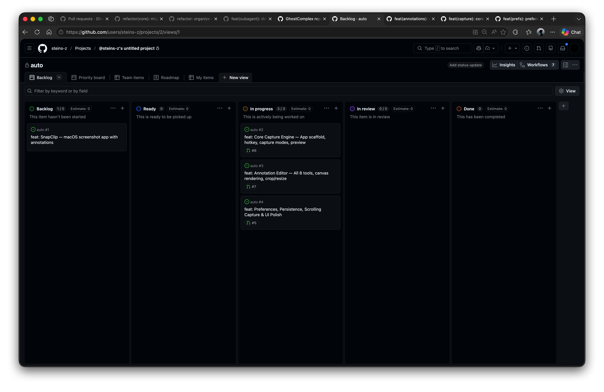
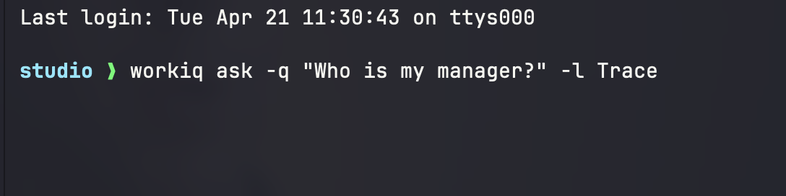

EMS Agent Workshop · 每日快报
=========================

📅 **2026-04-22（周三, Beijing Time）**
👥 参与人数：7 · 💬 消息数：10（含 2 条系统事件） · 🖼️ 图片：5 · 🔗 链接：4

---

🧩 1. Connect Write Skill 上架 PM Studio Library
----------------------------------------------

**发起人：** Jie Gao · **时间：** 10:18 BJT
**摘要：** 友情提示 Connect 下周四截止。强推 Connect Write skill：把文档贴进来 + Typeless 口喷几分钟就能出一份高质量 Connect。已上架 PM Studio Library（Setting → Skills → Library → Connect Write）。致谢 Huangful、Tracy。
**🧠 Edge Mobile PM 视角解读：** 季度 Connect 写作是所有 PM 的高频刚需，一个 skill 能把它从"拖延一整天"变成"口喷几分钟"，示范了 skill library 的真正价值——降低特定高频任务的启动摩擦。我们在 Edge Mobile 的 Copilot 场景里也应识别这类"每周/每月必做的低成交本高重复"任务，打造对应 skill（比如 release notes 生成、bug triage summary、weekly report）。
**🖼️ 图片：** 1 张（skill 宣传图）



**🔗 链接：** [PM Studio](https://aka.ms/projectstudio)
**🏷️ tags：** `#PMStudio` `#Skill` `#Connect` `#生产力`

---

🧩 2. Claude Pro 新用户也没法用 CC 了
------------------------------

**发起人：** Zhiyuan Zheng · **时间：** 10:37 BJT
**摘要：** 据说 Claude Pro 的新用户也被挡在 Claude Code 门外（截图为证）。这是继 Pro 额度持续缩水、老用户限流之后的又一轮收紧。
**🧠 Edge Mobile PM 视角解读：** Anthropic 正在有意把 CC 往更高付费档位（Max / Ultra）引导，Pro 档位的 CC 体验可能正式成为"入门诱饵"。依赖 CC 做工作流的团队（包括我们）要提前规划：1) 预算向 Max 升级，2) 评估 Opus/Sonnet 直接 API 调用 + 自建 gateway（如 menci/copilot-gateway、OpenClaw）作为备选，3) 避免把关键生产链路死锁在单一 SKU 上。
**🖼️ 图片：** 1 张



**🏷️ tags：** `#ClaudeCode` `#Pricing` `#供应商风险`

---

🧩 3. Agent Teams：把龙虾小队搬到本地
---------------------------

**发起人：** He Zhang · **时间：** 13:55 BJT
**摘要：** He Zhang 分享 "agent teams" 体验：可以把龙虾小队（内部多 agent 协作工作流）的工作方式完整搬到本地来，非常强。附一句自嘲："token 估计跑的也很厉害"。
**🧠 Edge Mobile PM 视角解读：** 多 agent 本地协作正从实验玩具往生产力工具过渡。对 Edge Mobile 而言，这条赛道可以看两个方向：1) 用多 agent 协作加速团队内部工作流（规划 + 执行 + 回顾三角色），2) 思考在浏览器产品侧，是否可以把多 agent 协作暴露给用户——例如"研究助手 + 写作助手 + 评审助手"合作完成一个任务，比单 agent 体验显著升级。但必须配 token 成本监控。
**🖼️ 图片：** 2 张（agent teams 运行截图）





**🏷️ tags：** `#AgentTeams` `#MultiAgent` `#龙虾小队` `#Token成本`

---

🧩 4. 内部 Search MCP：白嫖 websearch 的正解
----------------------------------

**发起人：** Yue Liu · **时间：** 14:08–14:10 BJT
**摘要：** 很多人在问怎么白嫖 GitHub Copilot 的 websearch 或开无头浏览器搜网页。Yue 指路：我们内部有 Microsoft Grounding 的 Search MCP，能搜图/视频，按信息类型分类，新建 token 即用。并贴了 MCP 接入配置：
```json
"Search-MCP": {
    "url": "https://api.microsoft.ai/v3/mcp/",
    "type": "http",
    "headers": { "x-apikey": "" }
}
```
**🧠 Edge Mobile PM 视角解读：** 这是个被严重低估的内部资产。Edge Mobile 里涉及 AI 搜索、AI 摘要、AI 购物推荐等场景都可以把 Microsoft Grounding 作为 retrieval 层，绕开 Bing Search API 的外部调用成本，也规避外部 websearch 的合规审核。建议产品团队立刻做一次内部 skill/MCP 资产盘点，避免重复造轮子。
**🔗 链接：** [Microsoft Grounding Playground](https://dashboard.microsoft.ai/playground/) · [Search MCP Endpoint](https://api.microsoft.ai/v3/mcp/)
**🏷️ tags：** `#MCP` `#Search` `#MicrosoftGrounding` `#内部资产`

---

🧩 5. Copilot Gateway cache 兼容问题 + 权限申请延迟
----------------------------------------

**参与人：** Jianjun Chen / Strong Liu · **时间：** 17:38 / 03:17 BJT
**摘要：**
- Jianjun：用 menci 的 copilot-gateway 的朋友们注意，CC 更新到 114 后可能 cache 不命中，加环境变量 `CLAUDE_CODE_ATTRIBUTION_HEADER=0` 可规避，PR fix 等 menci。
- Strong（承接 4/21 workiq 话题）：权限也申请了但跑半天没反应，配截图。
**🧠 Edge Mobile PM 视角解读：** 两件事共同说明——内部 AI 工具链目前处在"野蛮生长"阶段：自建 gateway 频繁因上游变更破坏、权限审批链条长且不透明。对产品研发 velocity 是实实在在的拖累。作为 Edge Mobile，我们在对接内部 AI 服务时要：1) 为每个依赖明确 fallback，2) onboarding 文档把"权限申请 → 生效"路径和预期时延写清楚，3) 对关键依赖设告警而非手工发现。
**🖼️ 图片：** 1 张（Strong 的 workiq 无响应截图）



**🏷️ tags：** `#CopilotGateway` `#menci` `#workiq` `#权限`

---

📊 价值评估表
-------

| # | 主题 | 信息价值 | 决策相关性 | Edge Mobile 可借鉴度 |
| --- | --- | --- | --- | --- |
| 1 | Connect Write skill | ⭐⭐⭐ | ⭐⭐⭐ | ⭐⭐⭐⭐ 生产力 skill 范式 |
| 2 | Claude Pro 无法用 CC | ⭐⭐⭐⭐ | ⭐⭐⭐⭐ | ⭐⭐⭐⭐ 供应商依赖 |
| 3 | Agent Teams 本地化 | ⭐⭐⭐⭐ | ⭐⭐⭐ | ⭐⭐⭐⭐ 多 agent 产品形态 |
| 4 | Search MCP | ⭐⭐⭐⭐ | ⭐⭐⭐⭐ | ⭐⭐⭐⭐⭐ 可直接用 |
| 5 | Gateway / 权限 | ⭐⭐ | ⭐⭐ | ⭐⭐ 流程优化 |

🌐 全局 tags
---------

`#PMStudio` `#ClaudeCode` `#AgentTeams` `#MCP` `#MicrosoftGrounding` `#内部资产` `#供应商风险` `#Skill`
