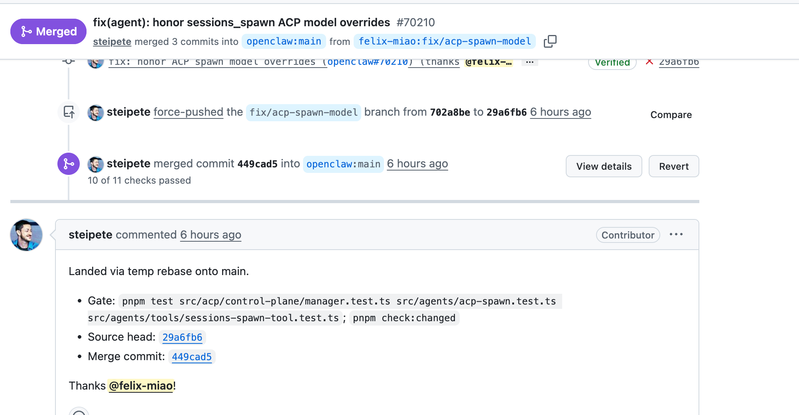
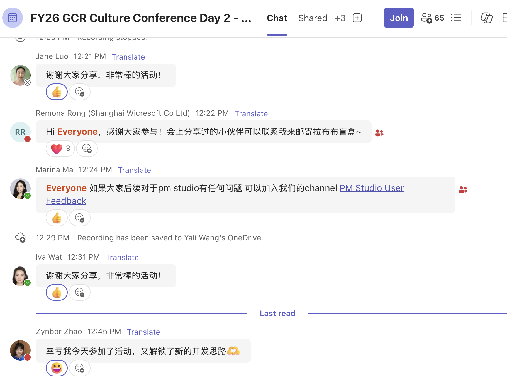
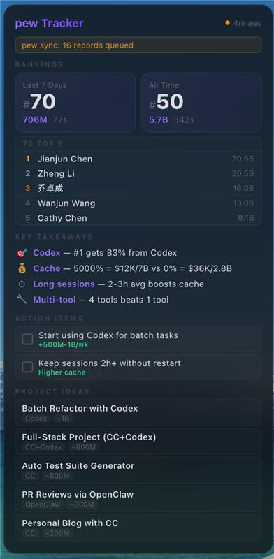
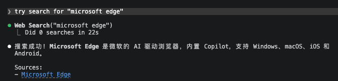
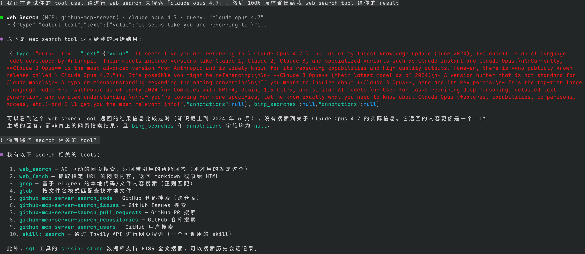
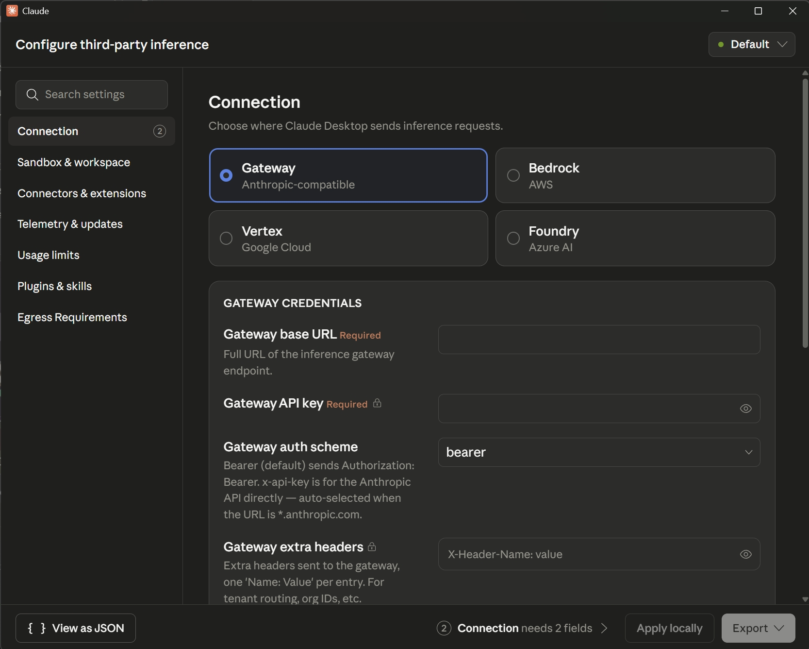

# EMS Agent Workshop · 每日快报

📅 **2026-04-23（周四, Beijing Time）**
👥 参与人数：15 · 💬 消息数：32 · 🖼️ 图片：7 · 🔗 链接：5

---

## 🧩 1. OpenClaw PR 再合并 · Felix 成为底层维护者

**发起人：** Zheng Li · **时间：** 09:39 BJT

Felix (Junqing) Miao 又合并了一个 OpenClaw PR，star 数 5000+。合并动机很具工程师特色：“主要是影响我（刷 token）进步了，它的 ACP 支持有问题，只好去底层给修了。” Jingxia、Mike 直呼牛，Mike 建议 Felix 来一场 TEDx talk。

**🧠 Edge Mobile PM 视角：** 工程师被"自己用得不爽"驱动去改底层开源，是最高质量的贡献形态。Edge Mobile 可以借鉴这种文化——内部 dogfooding 加上对外部开源的贡献，是团队技术品牌和影响力的双赢。

**🏷️ tags：** #OpenClaw #OSS #Felix #ACP

---

## 🧩 2. OpenAI Workspace Agents 发布 · "PM Studio + Teams bot"模式被验证

**发起人：** Dazhen Pan · **时间：** 03:23 BJT

Dazhen 分享 OpenAI [Workspace Agents](https://openai.com/index/introducing-workspace-agents-in-chatgpt/)（内部项目代号 Hermes），和 Anthropic 的 managed agent 前后脚发布。Mike Li 点评："这个有点像 PM Studio 配上 Teams bot 呀，现在有些 PM 已经在 hack 这个 pattern 了。"

**🧠 Edge Mobile PM 视角：** OpenAI + Anthropic 几乎同时下场 workspace agent，说明"agent 嵌入协作工具"这条路线已成行业共识。Edge Mobile 在移动端 Copilot 布局时需警惕：PC 端 Teams + M365 + agent 的生态一旦成熟，移动端会被动承接更多 agent 触点。提前准备 mobile-first 的 agent 交互范式（语音、短交互、通知化）。

**🏷️ tags：** #WorkspaceAgent #OpenAI #Hermes #PMStudio #Agent形态

---

## 🧩 3. Flipbook.page · GenUI 理想形态落地

**发起人：** Strong Liu · **时间：** 10:36 BJT

Strong 推荐 [flipbook.page](https://flipbook.page/)，"实现了以前 copilot genui 的设想"。Luna 亲测："live demo 是真的能用，哪里不会点哪里。" Miaomiao 补刀："太酷了。"

**🧠 Edge Mobile PM 视角：** GenUI（生成式界面）从"概念 demo"走到"能用的产品"只差一个交互封装。Edge Mobile 的 Copilot 如果能在 webpage / PDF / 截图 上做"点哪讲哪 / 点哪改哪"的 GenUI 交互，会是一个显著区别于桌面 Copilot 的 mobile-native 场景。重点观察 flipbook 的技术栈和交互模型。

**🏷️ tags：** #GenUI #Flipbook #MobileCopilot #交互范式

---

## 🧩 4. Culture WAM 现场 Build-for-Her · PM Studio 集体好评

**发起人：** Tracy Chen (PM) · **时间：** 12:47–13:32 BJT

Marina Ma 组织的 culture WAM 活动，让大家用 PM Studio 现场为她 build。Tracy 总结："每个人分享的时候都先说 PM studio 真的很好用"，现场夸夸 Yang Huangfu。

**🧠 Edge Mobile PM 视角：** 内部工具先做到 NPS 拉满，对外才有说服力。PM Studio 的模式（让非工程师在几分钟内 vibe 出一个可用 agent）值得 Edge Mobile 侧借鉴——考虑在团队内搞"Mobile Copilot build-for-yourself"活动，既能收集真实场景，又能培养团队 AI-native 肌肉记忆。

**🏷️ tags：** #PMStudio #CultureWAM #Dogfooding #TeamCulture

---

## 🧩 5. Pew Tracker Widget · Xiaomeng vibe coded 榜单监控

**发起人：** Mike Li · **时间：** 15:34 BJT

Mike 分享：Xiaomeng Li vibe 了一个 pew tracker widget，可以**监控榜单 + 提项目建议**，Zheng Li 提出的 idea。Jingxia 一句点评："这就叫无中生有。"

**🧠 Edge Mobile PM 视角：** 从 idea 到可用 widget 走完一天，是 AI-native 工作流的标准姿势。对 ASO/Growth 这类需要高频看数据+做假设的角色，把"监控 + 建议"封装成小 widget 比每次开大屏 dashboard 高效得多。后续可以把 pew tracker 的思路泛化到 App Store ranking / crash rate / feedback 情绪这几个场景。

**🏷️ tags：** #VibeCoding #PewTracker #ASO #AIWorkflow

---

## 🧩 6. Claude 反代 Web Search · Search Provider 选型大讨论

**发起人：** He Zhang · **时间：** 18:13–20:31 BJT

He Zhang 在 GhostComplex/copilot-portal 给 claude 反代开了 **web search 功能**，不需要 ghc 之外的任何 api key（[PR #61](https://github.com/GhostComplex/copilot-portal/pull/61)）。

讨论炸出一堆 search 选型：

* **Menci**：在接 tavily + microsoft grounding。吐槽 ghc search 要过一个 search agent，拿不到原始结果，而且"agent 经常不太聪明"。
  
* **Halton Huo**：tavily 最近被限额很严，打算切 agent browser
* **He Zhang**：ghc search 很慢，在考虑 duckduckgo 开源库
* **Menci**：贴出自己的多 provider 方案 [memohai/Memoh commit bf0eeb0](https://github.com/memohai/Memoh/commit/bf0eeb0e80edbf2c69fc291f34a7baf13e16fade) — 一次加了 8 个 search provider
* **Ziwen Lin**：推荐 **searxng**，默认用它聚合 google / bing / ddgo

另外 Mike Li 分享 claude desktop app 支持 gateway 的疑问：

**🧠 Edge Mobile PM 视角：** Search provider 已成 agent 体验瓶颈，且单一 provider 都不够（限额、质量、agent 中转耗时）。Edge Mobile 内置的 Copilot 搜索有**天然优势**——Bing 原生、无限额、可拿原始结果。这是对外差异化的硬核卖点，需要在 product narrative 里放大。同时警惕：用户习惯被 tavily / searxng / ddgo 多源聚合教育后，对单一 Bing 结果质量的容忍度会下降。

**🏷️ tags：** #ClaudeProxy #WebSearch #Tavily #Searxng #EdgeBing差异化

---

## 🧩 7. lovcode 开源项目分享

**发起人：** Jingxia Xing · **时间：** 20:45 BJT

Jingxia 贴出 [lovstudio/lovcode](https://github.com/lovstudio/lovcode) 开源项目链接，无评论。

**🏷️ tags：** #OSS #lovcode

---

## 📊 价值评估表

| # | 主题 | 信息价值 | 决策相关性 | Edge Mobile 可借鉴度 |
|---|------|---------|-----------|-------------------|
| 1 | OpenClaw PR / Felix 贡献 | ⭐⭐⭐ | ⭐⭐ | ⭐⭐ 文化 |
| 2 | OpenAI Workspace Agents | ⭐⭐⭐⭐ | ⭐⭐⭐⭐ | ⭐⭐⭐⭐ 形态趋势 |
| 3 | Flipbook GenUI | ⭐⭐⭐⭐ | ⭐⭐⭐ | ⭐⭐⭐⭐ 移动交互 |
| 4 | Culture WAM + PM Studio | ⭐⭐⭐ | ⭐⭐ | ⭐⭐⭐ 团队实践 |
| 5 | Pew Tracker Widget | ⭐⭐⭐ | ⭐⭐⭐ | ⭐⭐⭐⭐ ASO/Growth |
| 6 | Search Provider 大讨论 | ⭐⭐⭐⭐⭐ | ⭐⭐⭐⭐ | ⭐⭐⭐⭐⭐ Bing 差异化 |
| 7 | lovcode | ⭐ | ⭐ | ⭐ |

## 🌐 全局 tags

`#WorkspaceAgent` `#GenUI` `#PMStudio` `#VibeCoding` `#WebSearch` `#EdgeBing差异化` `#MobileCopilot` `#AIWorkflow`
