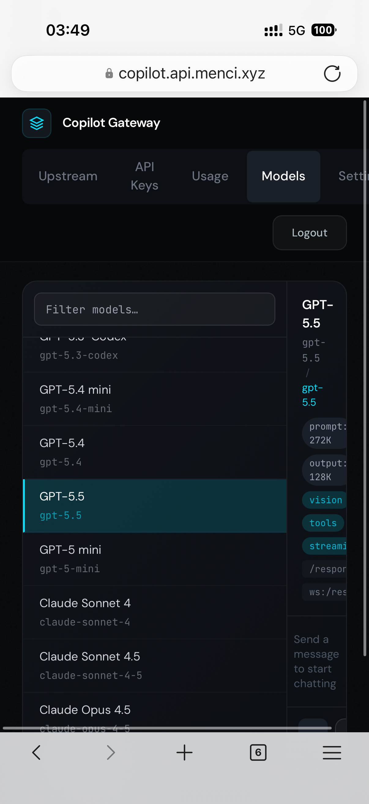
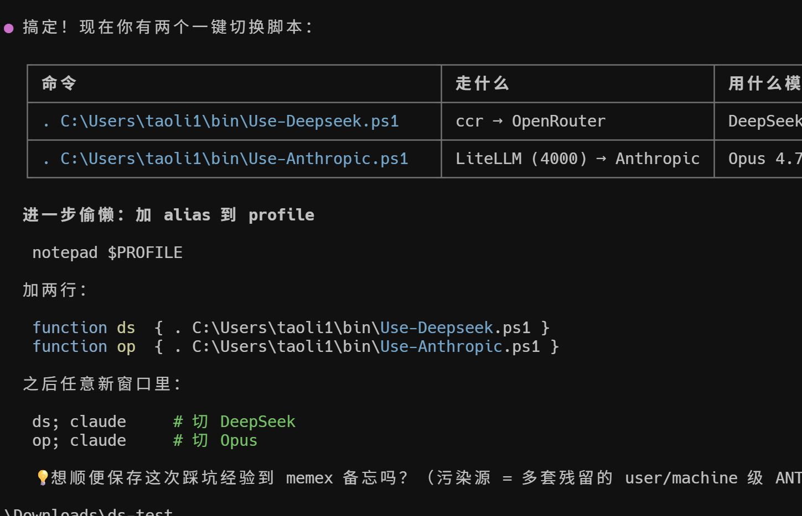

EMS Agent Workshop · 每日快报
=========================

📅 **2026-04-25（周六, Beijing Time）**
👥 参与人数：3 · 💬 消息数：3 · 🖼️ 图片：2 · 🔗 链接：0

---

🧩 1. GPT-5.5 疑似露脸 + memex「Memory of the memory」
-------------------------------------------------

**参与人：** Menci · Tao Li · Jingxia Xing · **时间：** 03:50–11:12 BJT

**摘要：** Menci 凌晨睡前刷到「gpt-5.5」线索（附图），简短一句"好像有了"。上午 11 点 Tao Li 接力发了一张 memex 工作流截图，配文"Memory of the memory"——展示了 memex 的"记忆套娃"用法。Jingxia 评价"memex 真棒"。周六话题不密集，但都是值得留意的工具/模型动向。

**🧠 Edge Mobile PM 视角解读：**
GPT-5.5 信号意味着 OpenAI 又一轮模型迭代节奏在逼近。每一次主力模型升级，对 Copilot/Edge 这种"以模型能力为依托"的产品都是一次 prompt + 体感的重新校准窗口。memex 的"记忆套娃"用法（用 memory tool 管理 memory tool 自身）是个有意思的 meta 思路，对 Edge Mobile 的个性化与上下文延续做长期规划值得参考。

**🖼️ 图片：**

**🏷️ tags：** #GPT-5.5 #memex #ModelEval #Memory #Agent工作流

---

📊 价值评估表
---------

| # | 主题 | 信息价值 | 决策相关性 | Edge Mobile 可借鉴度 |
| --- | --- | --- | --- | --- |
| 1 | GPT-5.5 / memex 套娃 | ⭐⭐⭐ | ⭐⭐ | ⭐⭐⭐ 模型动向 + 记忆设计 |

🌐 全局 tags
---------

`#GPT-5.5` `#memex` `#Memory` `#ModelEval` `#周末轻量日`

---

⚠️ **当日说明：** 周六群内仅 3 条消息，但 2 张图都有信息量（GPT-5.5 截图 + memex 工作流）。已全部 inline 嵌入。
