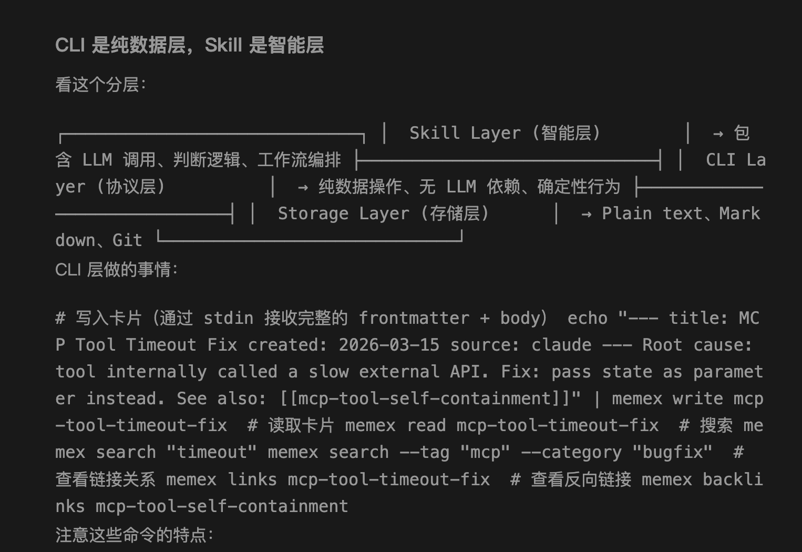
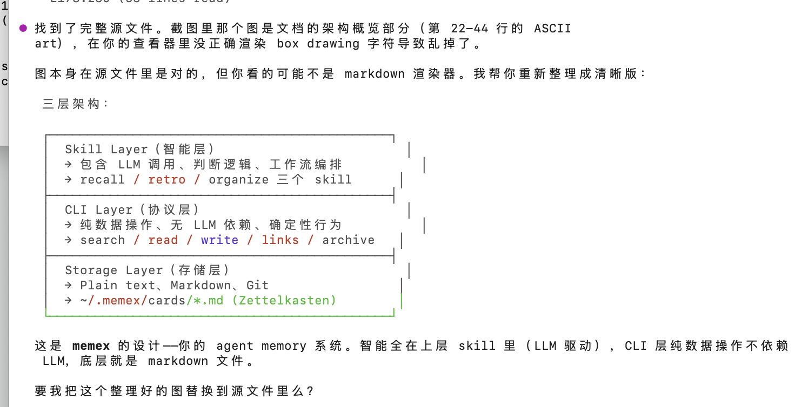

# EMS Agent Workshop 日报 · 2026-04-27（周一）

> 📅 覆盖时间：2026-04-27 00:00–23:59（北京时间）
> 👥 活跃成员：7人 | 💬 消息数：24条 | 🖼️ 图片：3张 | 🔗 外部链接：2个

---

## 📌 话题一：Claude Opus 4.7 内部版本 Capabilities 曝光

**发起人**：Wenkai JIANG | **时间**：11:02

Wenkai 分享了一份 `claude-opus-4.7-1m-internal` 的 model capabilities JSON，以下是关键参数：

```json
{
  "id": "claude-opus-4.7-1m-internal",
  "billing": { "is_premium": true, "multiplier": 10, "restricted_to": ["enterprise"] },
  "capabilities": {
    "family": "claude-opus-4.7-1m-internal",
    "limits": {
      "max_context_window_tokens": 1000000,
      "max_non_streaming_output_tokens": 16000,
      "max_output_tokens": 64000,
      "max_prompt_tokens": 936000
    },
    "supports": {
      "adaptive_thinking": true,
      "reasoning_effort": ["low", "medium", "high", "xhigh"],
      "parallel_tool_calls": true,
      "streaming": true,
      "structured_outputs": true,
      "tool_calls": true,
      "vision": true
    }
  },
  "model_picker_category": "powerful",
  "name": "Claude Opus 4.7 (1M context)(Internal only)"
}
```

🧠 **解读 & 应用建议（Edge Mobile PM 视角）**：
- 1M context window 是分水岭，意味着整个大型 codebase 可以一次性放入，代码理解/重构类 Agent 任务将从中受益显著
- `billing.multiplier: 10` 表明内部资源成本是普通模型 10 倍，需要精心设计 prompt 控制 token 消耗
- `reasoning_effort: xhigh` 是新选项，适合高复杂度规划任务（如 multi-step PR review 或 issue triage）
- Edge Mobile 如考虑集成 Anthropic 模型，需关注 enterprise 限制和计费结构

**Tags**：`#Claude` `#模型能力` `#LLM参数` `#enterprise`

---

## 📌 话题二：OpenClaw 新贡献者诞生 🎉

**发起人**：Bojun Chai | **时间**：14:06–14:13

Bojun 宣布 Jindong Fu 和 Yao Lu 成为 OpenClaw Contributor：
- PR 链接：[openclaw/openclaw#71520](https://github.com/openclaw/openclaw/pull/71520)

Menci 随后提到自己的 PR 被合并后，收到了大量转载 openclaw changelog 的 @ 通知（意料之外的副作用）。



🧠 **解读 & 应用建议**：
- OpenClaw 社区活跃度高，Contributor 认证体系正在形成，团队成员多人参与开源贡献是好信号
- Changelog 自动转载/@ 说明 openclaw 有健康的社区运营机制，可参考其 PR 管理流程
- Edge Mobile 在 Agent 工具链建设中，可以关注 openclaw 的 PR 自动化处理实践

**Tags**：`#OpenClaw` `#开源贡献` `#PR` `#社区`

---

## 📌 话题三：Peter Steinberger 的 AI Agent 自动批量处理 GitHub Issues

**发起人**：Mike Li | **时间**：14:14–14:17

讨论了 Peter Steinberger 的案例：
- 用 **clawsweeper** 并行运行 50 个 Codex，24/7 自动审批 Issue/PR
- 成果：关闭了 4000+ 个 issue
- 瓶颈：GitHub API rate limit（"刀不够快"）
- 问题：存在误判，明明 issue 未解决却被关闭（Luna Chen 反馈）

相关 X（Twitter）帖子：[Peter Steinberger - Built clawsweeper](https://x.com/steipete/status/2047982647264059734)

🧠 **解读 & 应用建议**：
- **机遇**：50 并行 Codex 的规模化 Agent 自动化是可实现的，且成本在可接受范围内
- **风险**：自动关闭 issue 的准确率问题——AI Agent 的"行动"需要更严格的 confidence threshold，不能只靠语义匹配
- **Edge Mobile 启示**：在 Edge Mobile 的 issue triage/PR review 自动化设计中，应区分"建议操作"和"自动执行"两个层次，高风险操作（关闭 issue）需要人工确认
- GitHub API rate limit 是规模化 AI 工作流的实际障碍，需要提前评估 quota

**Tags**：`#AIAgent` `#Codex` `#GitHub自动化` `#clawsweeper` `#大规模`

---

## 📌 话题四：GitHub 账号被封与申诉经验分享

**发起人**：Cathy Chen (ICE) | **时间**：14:36–14:56

Cathy 反映在**自己的 repo** 进行操作后 GitHub 账号被封，这与 Peter 案例相关联。

Bojun 分享个人经验：
- 申诉两次后账号被解除限制
- 客服回应："以后你不会遇到这个问题了"（白名单机制）
- 建议：主动与 GitHub Support engage



🧠 **解读 & 应用建议**：
- GitHub 对自动化行为（即使是自家 repo）有检测机制，AI Agent 大量 API 调用会触发封禁
- **Edge Mobile 风险提示**：如果团队计划部署 GitHub 自动化 Agent（issue triage、PR review），需提前与 GitHub 协商 rate limit 白名单或使用 GitHub Apps 而非个人 token
- 申诉路径可行，但有延迟风险，不适合生产环境依赖

**Tags**：`#GitHub` `#账号封禁` `#APIRateLimit` `#申诉经验`

---

## 📌 话题五：Menci 代码同步 & 知乎老板更新

**发起人**：Yue Liu (11:05) / Shaobo Yan (09:51)

- **Yue Liu**：menci 周末已更新完毕，日常拉取上游 menci 代码即可，维护模式顺畅
- **Shaobo Yan**：调侃每天打开知乎就是"老板新章节推送"——团队在密切跟踪知乎上的技术领袖动态

🧠 **解读 & 应用建议**：
- 上游依赖（menci）保持活跃更新是好信号，维护成本可控
- 知乎技术 KOL 内容对团队有实际参考价值，可考虑建立信息源聚合机制，减少人工刷新成本

**Tags**：`#menci` `#代码同步` `#信息源` `#知乎`

---

## 💡 全日价值评估

| 维度 | 评级 | 说明 |
|------|------|------|
| 技术信息密度 | ⭐⭐⭐⭐ | Claude 1M 模型参数、clawsweeper 50并行方案均为高价值信息 |
| 可操作性 | ⭐⭐⭐⭐ | GitHub 封号/申诉经验、Agent 行动阈值设计均有直接参考价值 |
| Edge Mobile 相关性 | ⭐⭐⭐ | AI Agent 自动化工作流与 Edge Mobile 中期规划强相关 |
| 社区活跃度 | ⭐⭐⭐ | OpenClaw Contributor 增加，团队参与度健康 |

**全局 Tags**：`#Claude4.7` `#1MContext` `#OpenClaw` `#GitHubAgent` `#clawsweeper` `#账号安全` `#AI自动化` `#代码同步`

---

*📁 本报告已归档至：`~/ems-agent-workshop/daily/2026-04/2026-04-27.md`*
*🔗 GitHub：https://github.com/BonnieLee0917/ems-agent-workshop/blob/main/daily/2026-04/2026-04-27.md*
