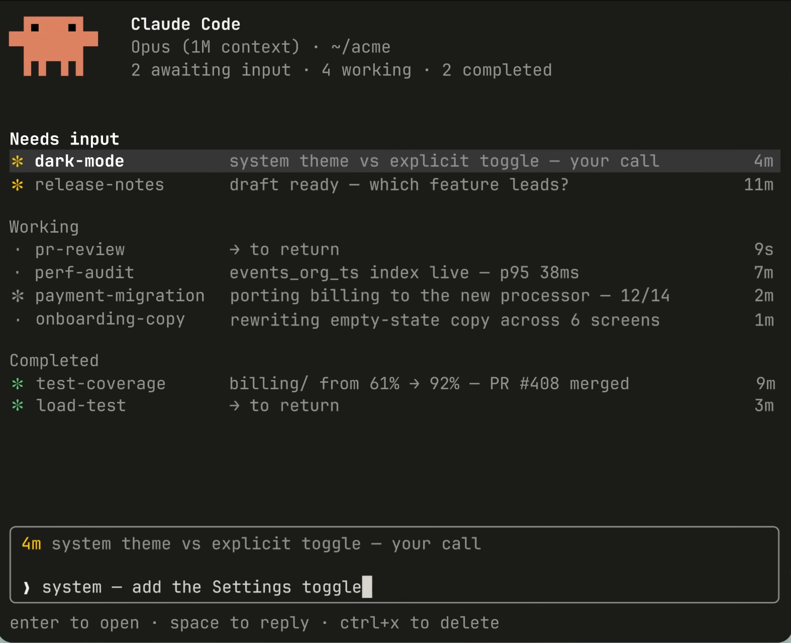

# EMS - Agent Workshop 日报 · 2026-05-12（周二）

> 📅 日期：2026-05-12（北京时间）｜💬 消息数：2｜👥 发言人：2｜🖼 图片：1｜🔗 外部链接：1

---

## 话题一：Claude Code 推出 Agent View — "CC 又来抢活了"

**发起人**：Dazhen Pan  
**时间**：06:58（BJT）  
**跟进**：Jingxia Xing 08:26 回复"早就该做了"（😆 × 1，👍 × 2）

### 核心内容

Dazhen Pan 分享了 Anthropic Claude Code 的新功能 **Agent View**，并附截图，调侃「CC 又来抢活了」——言下之意是 Claude Code 正在向 IDE/Agent 工作流更深层渗透。  
Jingxia Xing 跟进：「早就该做了」，表达了强烈认同。

🔗 原文链接：[https://claude.com/blog/agent-view-in-claude-code](https://claude.com/blog/agent-view-in-claude-code)

### 🧠 解读 & 应用建议（Edge Mobile PM 视角）

**为什么重要**：Claude Code 推出 Agent View 意味着 AI coding assistant 正在从「单步补全」进化为「多步骤任务代理」，可以在 IDE 内部可视化 Agent 决策链与执行路径。这是 Copilot/Edge AI 功能的直接竞品动作。

**对 Edge Mobile 的启示**：
1. **Agent 可视化是差异化点**：用户不只需要结果，更需要理解 Agent 在做什么。Edge Mobile 在未来 Copilot 功能中如能引入「任务执行进度/推理可见性」UI，将显著提升信任感。
2. **工具链竞争加速**：Claude Code 在开发者侧不断扩张，微软 Copilot 需要在移动/跨平台场景找到差异化定位，不能只打 VS Code 桌面战场。
3. **PM 需提前调研**：建议读完原文 blog，了解 Agent View 的具体交互设计，作为 Edge Copilot roadmap 参考。

**`#AI竞品` `#AgentUX` `#CopilotStrategy` `#ClaudeCode`**

---

## 📊 全日价值评估

| 维度 | 评分 | 说明 |
|------|------|------|
| 信息密度 | ⭐⭐⭐⭐ | 单条消息带高质量竞品情报 |
| 讨论热度 | ⭐⭐ | 2人参与，轻量互动 |
| 可行动性 | ⭐⭐⭐⭐ | 直接对应 roadmap 输入 |
| 紧迫性 | ⭐⭐⭐ | 竞品在动，需关注不需立即响应 |

---

**全局 Tags**：`#AI竞品` `#AgentUX` `#CopilotStrategy` `#ClaudeCode` `#日报`

---

*本报告由 PM Studio Agent 自动生成 · 覆盖北京时间 2026-05-12 00:00 ~ 23:59*  
*GitHub: https://github.com/BonnieLee0917/ems-agent-workshop/blob/main/daily/2026-05/2026-05-12.md*
