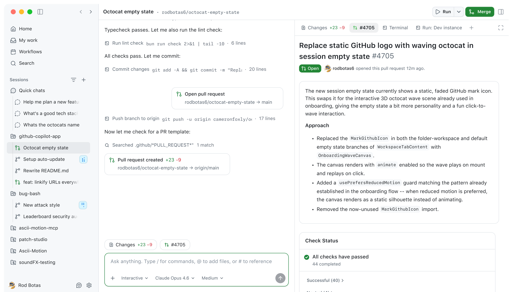

# 📋 EMS Agent Workshop 日报 | 2026-05-17（周日）

**日期**：2026-05-17（北京时间）
**消息数**：2 条
**参与人数**：2 人（Dale Xiao、Yang Gu）
**图片数**：1 张（已下载）
**外部链接**：1 条

---

## 💡 话题一：GitHub Copilot Tech Preview 体验分享

**发起人**：Dale Xiao
**时间**：12:25 BJT

**内容**：
Dale 分享了 GitHub Copilot 的新功能截图，画面显示 GitHub Desktop 应用中 PR Review 界面由 AI 自动组织 findings（发现问题）。评价：*"github copilot tech preview 感觉很不错啊"*。

**🧠 解读 & 应用建议**（Edge Mobile PM 视角）：

GitHub Copilot 正在将 AI 能力深度整合进代码 Review 工作流。这对 Edge Mobile 团队有两个启示：

1. **工程侧**：可以评估在 Edge Mobile repo 中引入 Copilot 的 PR Review 功能，减少人工审查时间，尤其对跨 timezone 的 review 场景有帮助。
2. **产品侧**：AI 辅助代码审查这一场景本身也是 Agent 能力的典型落地，可参考其 UI 设计思路 —— 如何将 AI findings 以结构化、可操作的方式展示给用户，对 Edge AI 功能的交互设计有借鉴价值。

**Tags**: `#GitHub Copilot` `#AI Code Review` `#Tech Preview` `#Developer Tools`

---

## 📊 话题二：Coding Agent Index 最新排名

**发起人**：Yang Gu
**时间**：14:28 BJT

**内容**：
Yang Gu 分享了 Coding Agent Index 最新数据：

> Opus 4.7 and GPT-5.5 lead the Index: **Opus 4.7 in Cursor CLI scores 61**, followed closely by **GPT-5.5 in Codex and Opus 4.7 in Claude Code at 60**.

**相关链接**：[🔗 Coding Agent Index（X.com）](https://x.com/ArtificialAnlys/status/2053865104396235059)

**🧠 解读 & 应用建议**（Edge Mobile PM 视角）：

Coding Agent 能力排行榜揭示了当前 AI 编程 Agent 的竞争格局：

1. **Claude Opus 4.7 + Cursor CLI** 以 61 分领跑，说明模型能力 × 工具集成的组合效果远超单一维度。GPT-5.5 在 Codex 中以 60 分紧随，竞争极为激烈。
2. **对 Edge AI 战略的意义**：如果 Edge 要构建自己的 Coding Agent 集成（如 Edge Copilot 功能），应优先考虑接入 Claude 或 GPT-5.5 级别的模型，而非仅靠当前 GPT-4 级能力。
3. **Mobile 开发视角**：Coding Agent 在移动开发场景（Swift/Kotlin）的表现还需关注，这些 Benchmark 多以 web/Python 为主，存在代表性偏差。

**Tags**: `#Coding Agent` `#AI Benchmark` `#Claude` `#GPT-5.5` `#Agent Index`

---

## 📈 今日价值评估

| 维度 | 评分 | 说明 |
|------|------|------|
| 信息密度 | ⭐⭐⭐ | 2 条消息，但两条均有实质内容 |
| 技术前沿性 | ⭐⭐⭐⭐ | Copilot tech preview + 最新 Agent Benchmark |
| 对 Edge Mobile PM 相关性 | ⭐⭐⭐ | 工具链参考价值高，直接应用场景待挖掘 |
| 讨论活跃度 | ⭐⭐ | 周日，消息量少，属正常 |

**本日亮点**：Coding Agent 能力竞争已进入高分段（60+），且排名高度依赖"模型 × 工具"组合，这对我们评估 AI 工具链选型有直接参考价值。

---

**全局 Tags**: `#AgentWorkshop` `#CodingAgent` `#GitHubCopilot` `#AIBenchmark` `#EdgeMobile`

---
*日报生成时间：2026-05-18 10:00 BJT | 覆盖范围：2026-05-17 00:00~23:59 BJT*
