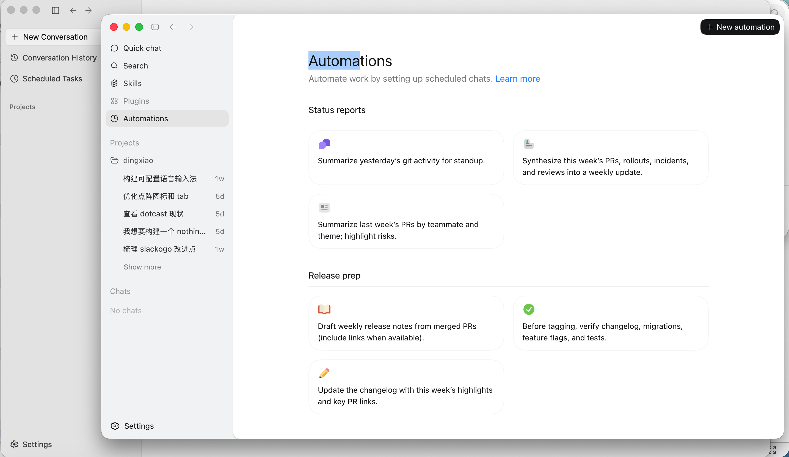

# EMS - Agent Workshop 日报 | 2026-05-20（周三）

> 📅 覆盖时间：2026-05-20 00:00–23:59（北京时间）
> 👥 活跃人数：2 | 💬 消息数：2 | 🖼️ 图片数：1 | 🔗 链接数：1

---

## 📌 话题一：Copilot 自动化误删 O365 Core Wiki 事件

**发起人**：Zhiyuan Zheng
**时间**：11:01 BJT
**😮 反应数**：5（成员均表示震惊）

### 📋 内容摘要

分享了一个 ICM Incident（[Incident 795614854](https://portal.microsofticm.com/imp/v5/incidents/details/795614854/summary)）：
- **事件**：O365 Core wiki 被 Copilot 自动化脚本清空，持续约 5 小时（发生于 2026-05-10）
- **处置**：已恢复（reverted），但重新编号导致的 broken links 仍需修复
- **发帖人补充**（中文）：前几天 Copilot 把 O365 Core 的 wiki 删完了 👀

**相关链接**：[ICM Incident 795614854](https://portal.microsofticm.com/imp/v5/incidents/details/795614854/summary)

### 🧠 解读 & 应用建议

这个事件对 **Edge Mobile PM** 有直接警示意义：

1. **Agent 自动化权限边界**：Copilot/Agent 执行写操作（尤其批量删除/改写）必须有人工确认门槛，不能全自动。Wiki 被清空说明该 Agent 的 "action scope" 定义过宽。
2. **边界案例参考**：在设计 Edge Mobile 的 AI 辅助流程（如 PM Studio、Bug 自动分类等）时，要明确 "read-only" 与 "write" 权限分离，并加 dry-run 模式。
3. **恢复机制**：O365 wiki 的 5h 停止服务 + 手动恢复 + broken links 残留，说明 rollback 机制不完善。我们自己的 Agent Workshop 产出物也应考虑版本控制/快照。
4. **用户信任**：群内 5 个 😮 反应说明此类事件严重影响团队对 Copilot 自动化的信任，Edge Mobile 在推 AI feature 时需提前做好"安全护栏"沟通。

**Tags**: `#CopilotAutomate` `#AIRisk` `#WikiIncident` `#O365` `#Agent安全`

---

## 📌 话题二：GitHub Copilot 新版 vs Codex vs 反重力对比

**发起人**：Dale Xiao
**时间**：10:36 BJT

### 📋 内容摘要

分享了一张对比截图（图片如下），附言：
> 「这下我看谁还能分得出 codex 和 反重力，坐等 GitHub Copilot 新版」

### 🧠 解读 & 应用建议

1. **Codex vs 反重力（Claude）竞争格局**：群内对 GitHub Copilot 的期待很高，说明开发者圈对"多模型竞争"已非常敏感，谁的代码补全/对话体验更好将直接影响工具选择。
2. **Edge Mobile PM 视角**：
   - GitHub Copilot 在 VS Code/IDE 生态的整合度极高，如果新版性能追平甚至超越 Claude，开发团队的工具链可能发生迁移。PM 需关注团队实际使用工具变化，及时更新协作流程。
   - 对 Edge 的 AI 功能来说，Copilot 在代码场景的提升 → 开发者用户对 AI 辅助期望水涨船高 → Edge AI 功能也需跟进迭代。
3. **行动建议**：关注 GitHub Copilot 新版发布节点，考虑在 Edge Mobile 开发流程中做对比评测，数据支撑后续 AI feature 选型。

**Tags**: `#GitHubCopilot` `#Codex` `#AIComparison` `#开发工具` `#竞争格局`

---

## 📊 价值评估

| 维度 | 评分 | 说明 |
|------|------|------|
| 信息密度 | ⭐⭐⭐⭐ | 两条消息均含实质内容 |
| 行动价值 | ⭐⭐⭐⭐ | Copilot 事故有直接警示意义 |
| 竞争情报 | ⭐⭐⭐ | AI 工具对比有参考价值 |
| 紧迫性 | ⭐⭐ | 无紧急跟进项 |

---

## 🏷️ 全局 Tags
`#EMS` `#AgentWorkshop` `#CopilotRisk` `#AITools` `#GitHubCopilot` `#O365Incident` `#2026-05-20`

---

*本日报由 PM Studio 自动生成 | 数据源：EMS Agent Workshop 群聊 Graph API*
*GitHub 存档：https://github.com/BonnieLee0917/ems-agent-workshop/blob/main/daily/2026-05/2026-05-20.md*
